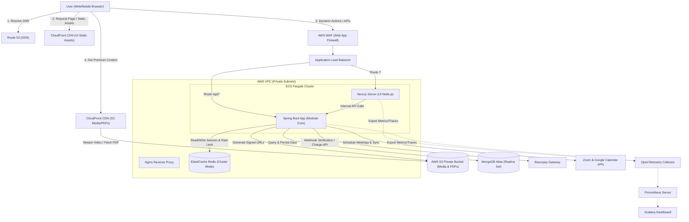

# High-Level Design (HLD) & Service Boundaries - beingsde

This document outlines the System Architecture and Service Boundaries for **beingsde**, a premium production-ready System Design Learning Platform.

---

## 1. System Architecture Diagram

The architecture is designed for **high availability**, **horizontal scalability**, **fault tolerance**, and **strict security**.



---

## 2. Component Explanations

| Component | Responsibility | Scaling Strategy |
| :--- | :--- | :--- |
| **CloudFront CDN** | Caches Next.js static files and streams video lectures/PDF assets. Utilizes CloudFront Signed URLs for premium content. | Edge-cached, automatically scales globally. |
| **AWS WAF** | Inspects incoming traffic, protecting against OWASP Top 10, SQL injection, and DDoS attacks. | Managed service, automatically scales. |
| **Application Load Balancer (ALB)** | Routes incoming traffic based on path rules. `/api/*` goes to Spring Boot Core, while `/*` goes to the Next.js server. | Managed, scales horizontally. |
| **Next.js (App Router)** | Renders UI views. Uses Server-Side Rendering (SSR) for static/dynamic content (e.g. topic pages for SEO) and Client-Side Rendering (CSR) for interactive dashboards. | Horizontal pod/container scaling via ECS Fargate auto-scaling policies based on CPU/Memory. |
| **Spring Boot Core** | Houses backend business logic, JWT authentication, billing, scheduling, and admin features. | Stateless API container scaling on ECS Fargate using CPU utilization thresholds (>70%). |
| **ElastiCache Redis** | Handles distributed session caching, rate limiting (bucket token), and caching of feature flags & hot topics. | Multi-AZ deployment with primary-replica replication and auto-failover. |
| **MongoDB Atlas** | Document store for users, learning progress, payments, and mock interviews. | Multi-region replica set with read-scaling from local secondaries. Atlas Search configured for topics search. |
| **AWS S3** | Secure storage for educational PDFs, video content, and avatar uploads. | Scalable object storage. Protected via IAM roles. |

---

## 3. Logical Domains & Service Boundaries

We design the Spring Boot application as a **Modular Monolith** organized into distinct domain packages. This enforces strict boundaries using package-private visibility, standardizing dependencies, and keeping the codebase ready to split into microservices if needed.

```
com.beingsde.core
├── auth                # Authentication & User Management
├── billing             # Premium Subscriptions, Razorpay Integration, Invoices
├── content             # CMS, Topics, Categories, Versioning, Tag Management
├── progress            # Streak Tracking, Learning Heatmap, Topic Completions
├── interviews          # Booking, Slot Management, Integration (Zoom/Meet), Feedback
├── featureflags        # Rules engine, subscription rollouts, percentage rollouts
├── search              # Atlas Search Integration, Autocomplete, Keyword Search
├── analytics           # Events tracking, Admin Dashboard aggregation
└── common              # Exception Handling, Base Configs, Observability Setup
```

### Domain Boundary Specifications

#### A. Authentication & User Management (`auth`)
* **Boundaries**: Manages the user profile and credentials. Handles registration, email verification, password resets, and JWT issuing.
* **Dependencies**: Relies on `billing` (to fetch user subscription tier during context load) and `progress` (triggers on user deletion to clean up progress).

#### B. Content Management (`content`)
* **Boundaries**: Read-only access for users, write access for Admins. Manages Topic, Tag, and Category models. Controls access to files (PDF/Video links).
* **Dependencies**: Depends on `featureflags` to evaluate if a piece of content is available for the current user.

#### C. Feature Flag Engine (`featureflags`)
* **Boundaries**: Custom rules engine. Must be highly optimized since it is invoked on almost every content access request.
* **Dependencies**: Depends on `auth` (to inspect User Role/ID) and `billing` (to check subscription tier).

#### D. Billing & Subscription (`billing`)
* **Boundaries**: Integrates with Razorpay SDK. Manages subscription lifecycle (active, expired, trailing). Emits events when subscription updates.
* **Dependencies**: Exposes a subscription status service used by `featureflags` and `auth`.

#### E. Mock Interview Module (`interviews`)
* **Boundaries**: Manages bookings, slots availability, interviewer schedules, and Zoom meeting links creation.
* **Dependencies**: Invokes `auth` (verifying user roles like Interviewer/Premium User).

#### F. Learning Progress (`progress`)
* **Boundaries**: Tracks streaks, completion logs, and heatmap logs. Highly write-heavy.
* **Dependencies**: Needs read access to `content` to map completions to categories.

---

## 4. Communication & Event Flows

For decoupling, the modular monolith uses **Application Events** (Spring ApplicationEventPublisher) or an event bus (like Redis Pub/Sub or MongoDB Change Streams) to keep components decoupled.

### Scenario: User Completes Subscription Purchase
1. `Billing Service` receives Razorpay webhook signature verifying the payment.
2. `Billing Service` transitions user status in `subscriptions` to `PREMIUM`.
3. `Billing Service` publishes a `SubscriptionUpgradedEvent`.
4. `Feature Flag Service` catches this event and immediately invalidates the user's cached flags in Redis.
5. `Analytics Service` captures the event to increment the premium conversion count on the Admin Dashboard.
