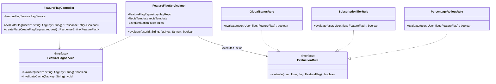
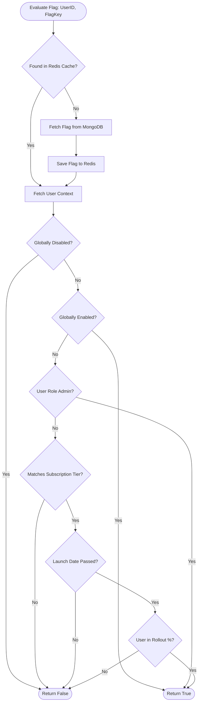

# Low-Level Design (LLD) & Feature Flag Design - beingsde

This document describes the Class-Level Structure, Design Patterns, and the complete architecture for the **Feature Flag Evaluation Engine**.

---

## 1. Class Design & Design Patterns

We use the standard Controller-Service-Repository pattern in Spring Boot, enhanced with specific design patterns to handle payments, integrations, and feature flags.



### Design Patterns Used
* **Strategy Pattern (`EvaluationRule`)**: Encapsulates rules (Global Status, Subscription Tier, User Roles, Percentage Rollout) so rules can be added, modified, or re-ordered independently.
* **Factory Pattern**: Dynamically selects external service handlers (e.g. `MeetingServiceFactory` returns a `ZoomMeetingService` or `GoogleMeetService` instance based on configuration).
* **Observer Pattern (Spring Application Events)**: Handlers react to billing events to invalidate cache configurations without coupling.

---

## 2. Feature Flag Rules & Evaluation Pipeline

The platform relies heavily on feature flags to lock premium content (topics, videos, PDFs), test new features, and roll out changes gradually.

### The Evaluation Flowchart



---

## 3. Percentage Rollout Hashing Algorithm

To ensure a consistent user experience, the same user must always evaluate to the same value (True/False) for a specific feature flag. We avoid random number generation (`Math.random()`) and instead use a **deterministic hashing algorithm** based on the `userId` and `flagKey`.

### Hashing Implementation in Java

```java
import java.nio.charset.StandardCharsets;
import com.google.common.hash.Hashing;

public class RolloutEvaluator {

    /**
     * Determines whether a user falls within the rollout percentage of a feature flag.
     * Uses MurmurHash3 to generate a uniform distribution.
     *
     * @param userId The unique ID of the user.
     * @param flagKey The unique identifier of the feature flag.
     * @param rolloutPercentage Integer value from 0 to 100.
     * @return true if user is selected, false otherwise.
     */
    public static boolean isUserInRollout(String userId, String flagKey, int rolloutPercentage) {
        if (rolloutPercentage <= 0) return false;
        if (rolloutPercentage >= 100) return true;
        
        // Salt the input with the flag key to distribute user hashes across different flags
        String hashInput = flagKey + ":" + userId;
        
        // Get 32-bit MurmurHash3 hash
        int hashVal = Hashing.murmur3_32_fixed()
                .hashString(hashInput, StandardCharsets.UTF_8)
                .asInt();
        
        // Normalize hash value to a bucket from 0 to 99
        int bucket = Math.abs(hashVal) % 100;
        
        return bucket < rolloutPercentage;
    }
}
```

---

## 4. Cache Strategy & Cache Invalidation

Since feature flags are checked on every topic query, page load, and resource access, reading them from MongoDB Atlas every time introduces unacceptable latency and database cost.

### Caching Architecture

* **Cache Type**: Redis Cluster (Cache-Aside Pattern)
* **Redis Key Namespace**: `featureflag:{flagKey}`
* **TTL (Time to Live)**: 1 Hour (`3600 seconds`)

### Cache Invalidation Logic

Whenever an Admin updates a feature flag (e.g. increases rollout percentage from `10%` to `50%`, or enables a premium video globally):

1. The write operation goes to MongoDB.
2. Upon success, the Spring Boot application publishes an `AdminFeatureFlagUpdatedEvent` internally or to a Redis Pub/Sub channel.
3. The event listener deletes the Redis key: `DEL featureflag:{flagKey}`.
4. On the next user request, a cache miss triggers, reloading the updated flag data from MongoDB and caching it back into Redis.

### Sample Redis Invalidation Method

```java
@Service
public class FeatureFlagServiceImpl implements FeatureFlagService {
    
    @Autowired
    private FeatureFlagRepository flagRepo;
    
    @Autowired
    private StringRedisTemplate redisTemplate;
    
    private static final String REDIS_PREFIX = "featureflag:";

    @Override
    public FeatureFlag getFlag(String flagKey) {
        String key = REDIS_PREFIX + flagKey;
        String cachedValue = redisTemplate.opsForValue().get(key);
        
        if (cachedValue != null) {
            return deserialize(cachedValue); // Deserializes from JSON
        }
        
        // Database fallback
        FeatureFlag flag = flagRepo.findByKey(flagKey)
                .orElseThrow(() -> new ResourceNotFoundException("Flag not found"));
        
        // Cache aside setup
        redisTemplate.opsForValue().set(key, serialize(flag), 1, TimeUnit.HOURS);
        return flag;
    }

    @Override
    public void invalidateCache(String flagKey) {
        String key = REDIS_PREFIX + flagKey;
        redisTemplate.delete(key);
    }
}
```
