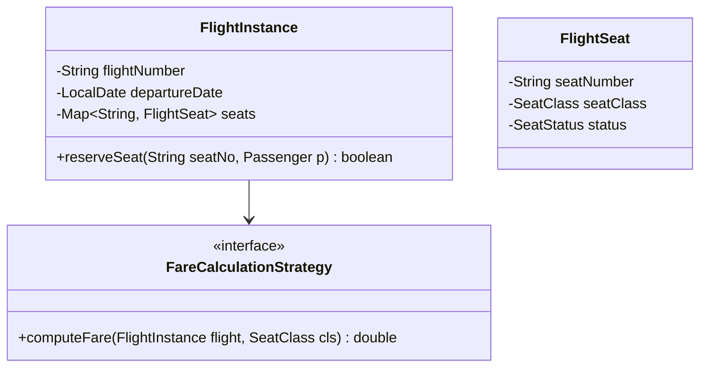
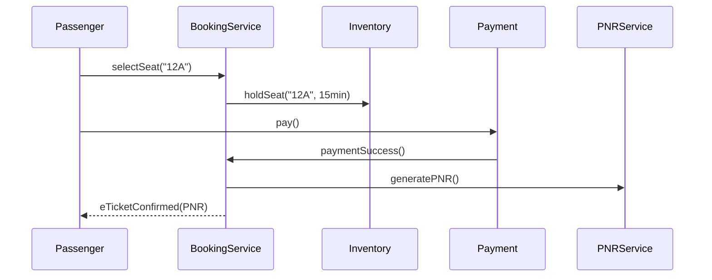

# Low Level Design (LLD): Airline Reservation

> **Category**: Transactional / Concurrency  
> **Difficulty**: Hard  
> **Primary Design Patterns**: Factory (Seat/Flight class creation), Observer (Flight delay and gate change alerts), Strategy (Baggage and fare rules)

---

## 1. Actors & Use Cases

### 1.1 Actors
- **Passenger**: Passenger
- **Travel Agent**: Travel Agent
- **Airline Operations Desk**: Airline Operations Desk

### 1.2 Core Use Cases
- Search flights with multi-city or return legs
- Cabin seat selection (Economy, Premium, Business, First)
- Inventory hold during passenger detail and baggage input
- PNR (Passenger Name Record) generation upon payment
- Gate and schedule adjustment notifications

---

## 2. Class Diagram

---

## 3. Key Interfaces & Abstractions

- `FareCalculationStrategy`: Dynamic bucket yield management pricing.

---

## 4. Design Patterns Applied

- State pattern tracks seat and PNR lifecycles.
- Observer pattern alerts passengers to gate updates.

---

## 5. Sequence Diagram (Key Execution Flow)

---

## 6. Data Model & Storage Strategy

Tables `flights`, `flight_instances`, `seats`, `passengers`, `bookings` (PNR).

---

## 7. Concurrency & Thread Safety Plan

Strict optimistic locking (`version` column) on inventory seats to avoid double bookings during massive holiday sales.

---

## 8. Failure Modes & Edge Cases

- **Overbooking allowed by yield management**: System prioritizes frequent flyers when assigning boarding passes.

---

## 9. Extensibility Points

- **Frequent Flyer loyalty redemption engine and automated check-in.**: Frequent Flyer loyalty redemption engine and automated check-in.
