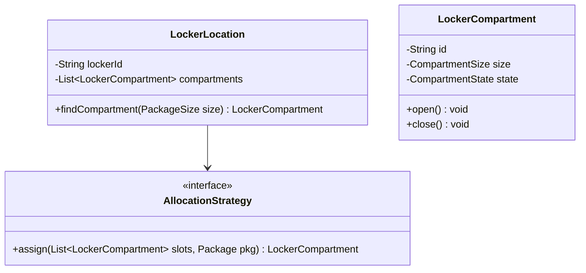
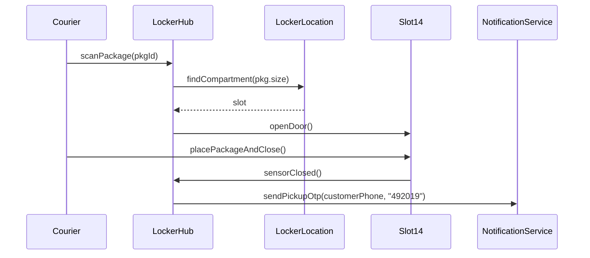

# Low Level Design (LLD): Amazon Locker

> **Category**: OOD / Allocation  
> **Difficulty**: Medium  
> **Primary Design Patterns**: Strategy (Locker slot allocation: nearest, best fit), Factory (Locker sizes), Observer (Delivery and Customer pickup PIN notifications)

---

## 1. Actors & Use Cases

### 1.1 Actors
- **Delivery Courier**: Delivery Courier
- **Customer**: Customer
- **Locker Hardware Hub**: Locker Hardware Hub

### 1.2 Core Use Cases
- Assign optimal locker compartment based on package dimensions
- Generate secure 6-digit one-time pickup code and QR code
- Courier deposit flow with door sensor verification
- Customer pickup flow with auto-opening door latch
- Overdue package return workflow after 3 days

---

## 2. Class Diagram

---

## 3. Key Interfaces & Abstractions

- `AllocationStrategy`: Evaluates fit (Small, Medium, Large, Extra-Large) with energy-efficient door clustering.

---

## 4. Design Patterns Applied

- Strategy pattern enables smart packing algorithms.
- Observer pattern alerts customers via SMS/Email with OTP on package deposit.

---

## 5. Sequence Diagram (Key Execution Flow)

---

## 6. Data Model & Storage Strategy

Tables `lockers`, `compartments`, `packages`, `pickup_codes`.

---

## 7. Concurrency & Thread Safety Plan

Slot state transitions protected by optimistic locking with version checks.

---

## 8. Failure Modes & Edge Cases

- **Customer forgets code**: 2FA mobile verification override on locker touch terminal.

---

## 9. Extensibility Points

- **Solar-powered smart lockers with refrigerated compartments for grocery deliveries.**: Solar-powered smart lockers with refrigerated compartments for grocery deliveries.
