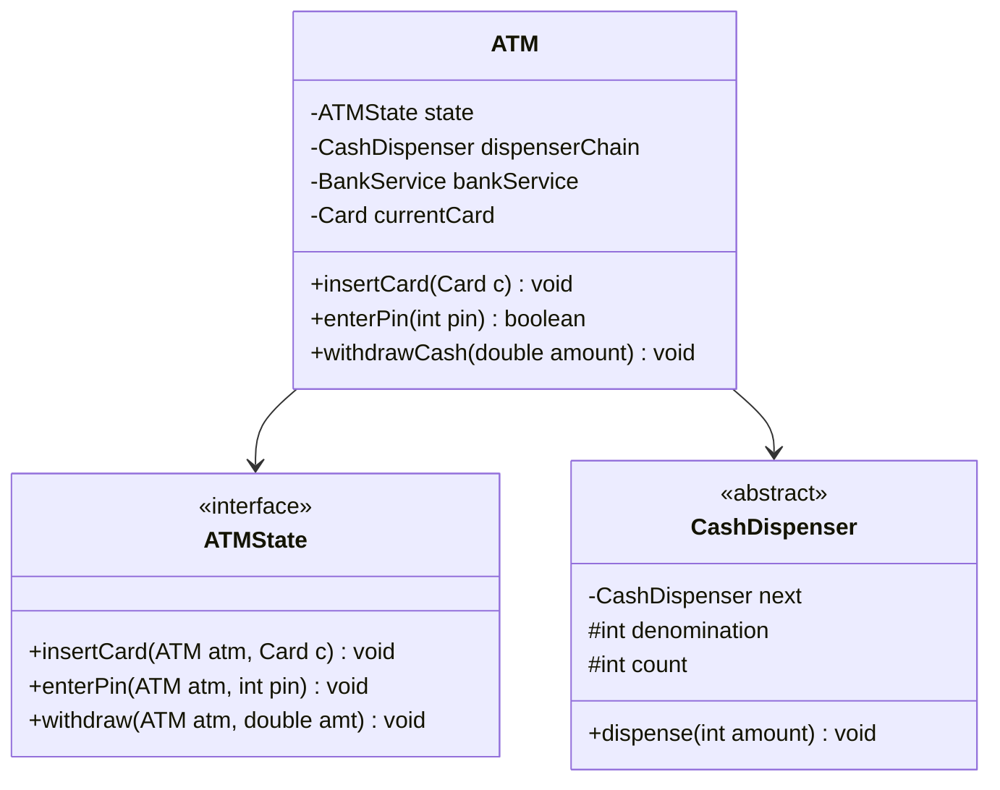
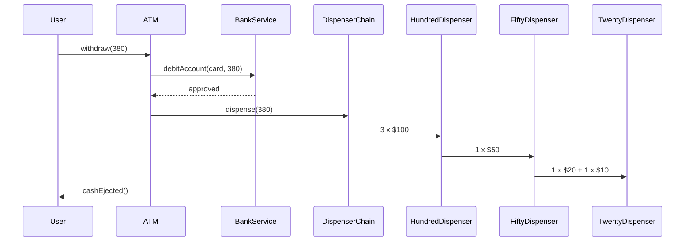

# Low Level Design (LLD): ATM Machine

> **Category**: State / Concurrency  
> **Difficulty**: Hard  
> **Primary Design Patterns**: State Pattern (CardInserted, PinEntered, TransactionSelected, Dispensing), Chain of Responsibility (Cash dispenser: $100 -> $50 -> $20 bills)

---

## 1. Actors & Use Cases

### 1.1 Actors
- **Bank Customer**: Bank Customer
- **Bank Central Host / Switch**: Bank Central Host / Switch
- **Cash Replenishment Service**: Cash Replenishment Service

### 1.2 Core Use Cases
- Card authentication & PIN verification with retry limit
- Account balance inquiry
- Cash withdrawal with multi-denomination cash dispenser
- Deposit cash/check
- Card retention on repeated fraud attempts

---

## 2. Class Diagram

---

## 3. Key Interfaces & Abstractions

- `CashDispenser`: Chain of responsibility handling note counts.

---

## 4. Design Patterns Applied

- State pattern securely guides workflow.
- Chain of Responsibility distributes cash bills gracefully.

---

## 5. Sequence Diagram (Key Execution Flow)

---

## 6. Data Model & Storage Strategy

Tables `atm_terminals`, `atm_cash_cassettes`, `transactions`.

---

## 7. Concurrency & Thread Safety Plan

Two-phase commit (2PC) between ATM hardware controller and Bank Host ledger.

---

## 8. Failure Modes & Edge Cases

- **Power outage during cash dispense**: Hardware reverse-journal audit roll logs uncollected money.

---

## 9. Extensibility Points

- **Cardless withdrawal via NFC and biometric fingerprint scanner.**: Cardless withdrawal via NFC and biometric fingerprint scanner.
