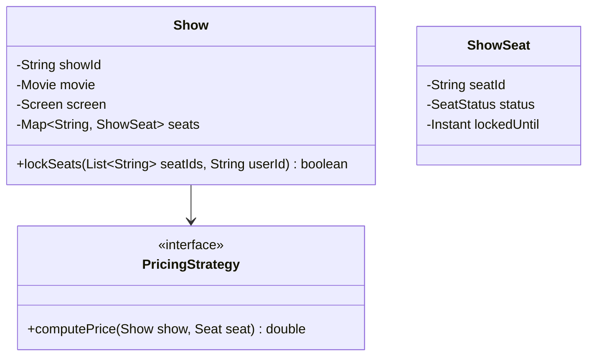
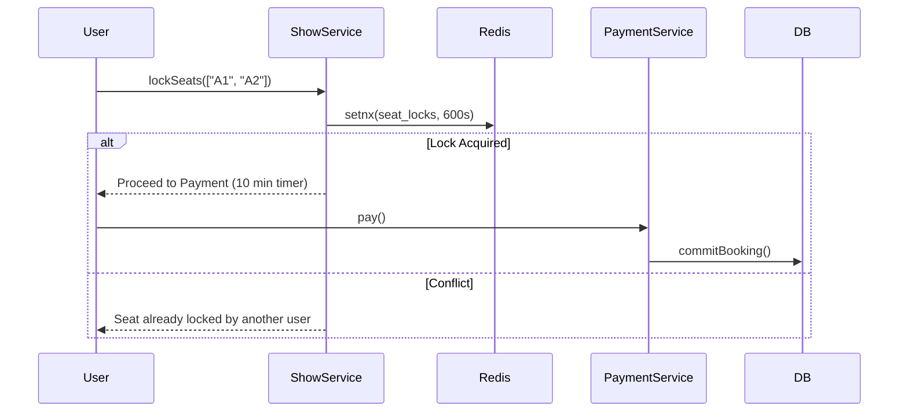

# Low Level Design (LLD): BookMyShow (Movie Ticket Booking)

> **Category**: Concurrency / Transactional  
> **Difficulty**: Hard  
> **Primary Design Patterns**: Strategy (Dynamic ticket pricing), Observer (Seat lock timer & release), State Pattern (Seat: Available, Reserved, Booked)

---

## 1. Actors & Use Cases

### 1.1 Actors
- **Moviegoer**: Moviegoer
- **Cinema Owner**: Cinema Owner
- **Payment Processor**: Payment Processor

### 1.2 Core Use Cases
- Browse shows by city, cinema, and timing
- Interactive seat map with real-time availability
- Temporary 10-minute seat locking during checkout
- Payment completion and QR e-ticket generation
- Auto-release of locked seats if payment window expires

---

## 2. Class Diagram

---

## 3. Key Interfaces & Abstractions

- `PricingStrategy`: Weekend surge, holiday premiums, and front-row discounts.

---

## 4. Design Patterns Applied

- State pattern tracks seat life-cycle.
- Strategy pattern calculates dynamic pricing.
- Observer pattern wakes up seat releasing worker on timeout.

---

## 5. Sequence Diagram (Key Execution Flow)

---

## 6. Data Model & Storage Strategy

Tables `theatres`, `screens`, `shows`, `show_seats` (show_id, seat_no, status, locked_at).

---

## 7. Concurrency & Thread Safety Plan

Distributed locking via Redis Redlock or database conditional update `UPDATE show_seats SET status='LOCKED' WHERE status='AVAILABLE'`.

---

## 8. Failure Modes & Edge Cases

- **Payment gateway drops webhook**: Asynchronous reconciliation worker checks PG status before releasing seats.

---

## 9. Extensibility Points

- **F&B add-on bundling and seat upgrade recommendations.**: F&B add-on bundling and seat upgrade recommendations.
