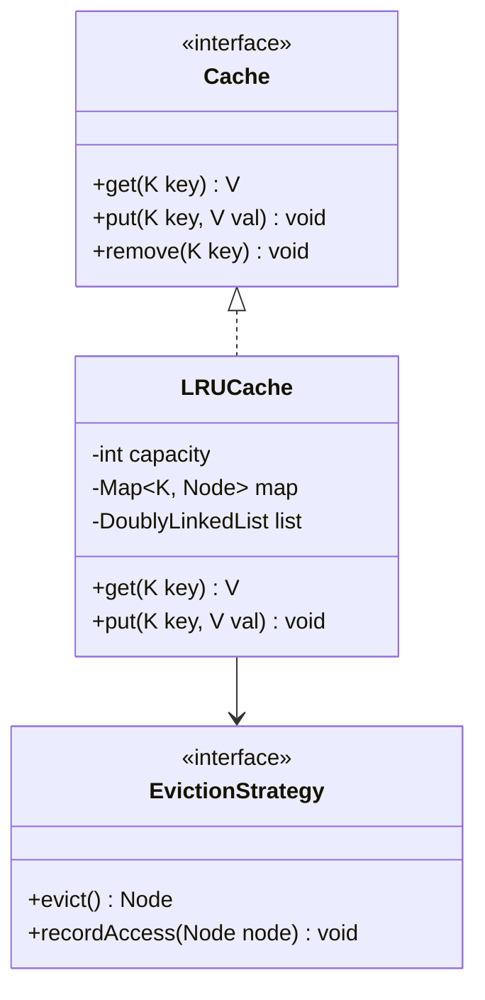
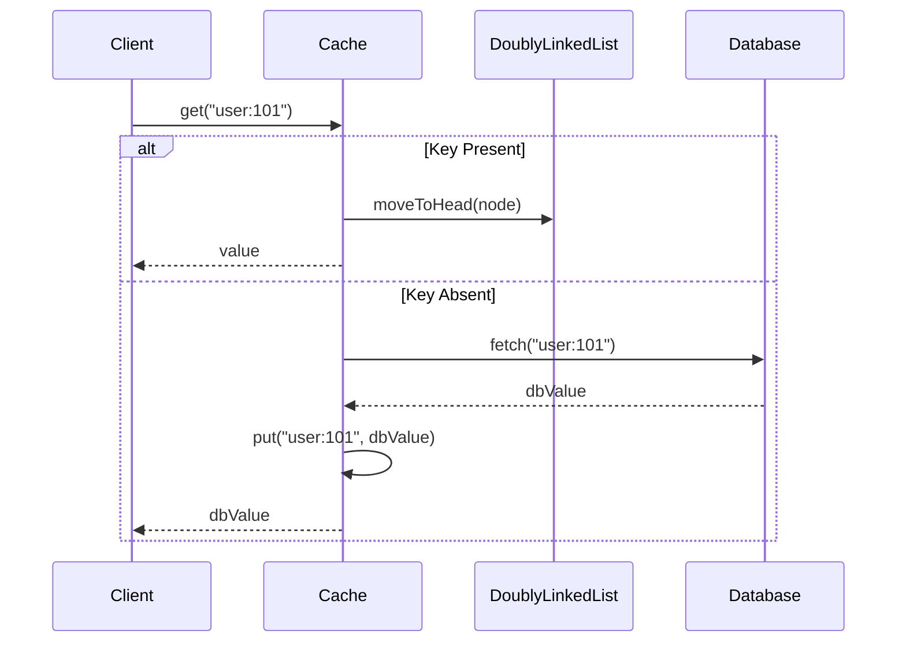

# Low Level Design (LLD): Cache (LRU / LFU)

> **Category**: Structural  
> **Difficulty**: Medium  
> **Primary Design Patterns**: Proxy Pattern (Transparent caching layer), Strategy Pattern (Eviction policy: LRU, LFU, FIFO), Singleton (CacheManager)

---

## 1. Actors & Use Cases

### 1.1 Actors
- **Application Service**: Application Service
- **Underlying Persistent Store / DB**: Underlying Persistent Store / DB

### 1.2 Core Use Cases
- O(1) get(key) and put(key, value)
- Automatic eviction when max capacity is reached
- TTL expiration management
- Write-through vs Write-back memory sync

---

## 2. Class Diagram

---

## 3. Key Interfaces & Abstractions

- `EvictionStrategy`: `recordAccess(Node node)` and `evict() -> Node`.

---

## 4. Design Patterns Applied

- Proxy pattern intercepts calls to expensive backend databases.
- Strategy pattern isolates eviction mechanics.

---

## 5. Sequence Diagram (Key Execution Flow)

---

## 6. Data Model & Storage Strategy

In-memory Hash Table coupled with Doubly Linked List (LRU) or Frequency Bucket List (LFU).

---

## 7. Concurrency & Thread Safety Plan

Fine-grained segmented striping (like ConcurrentHashMap) or ReadWriteLock to allow concurrent reads.

---

## 8. Failure Modes & Edge Cases

- **Cache Stampede**: Mutex lock on key miss ensures only one thread queries the database for re-population.

---

## 9. Extensibility Points

- **Distributed tiering (L1 in-memory Caffeine + L2 Redis cluster).**: Distributed tiering (L1 in-memory Caffeine + L2 Redis cluster).
