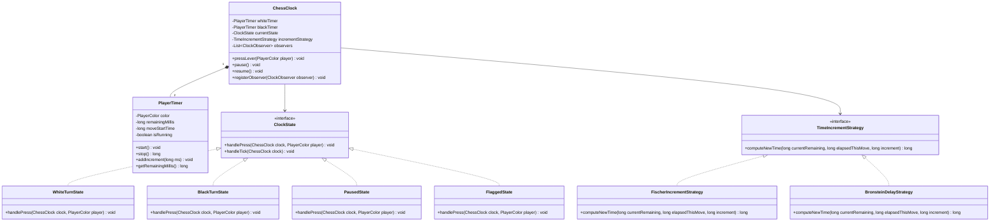
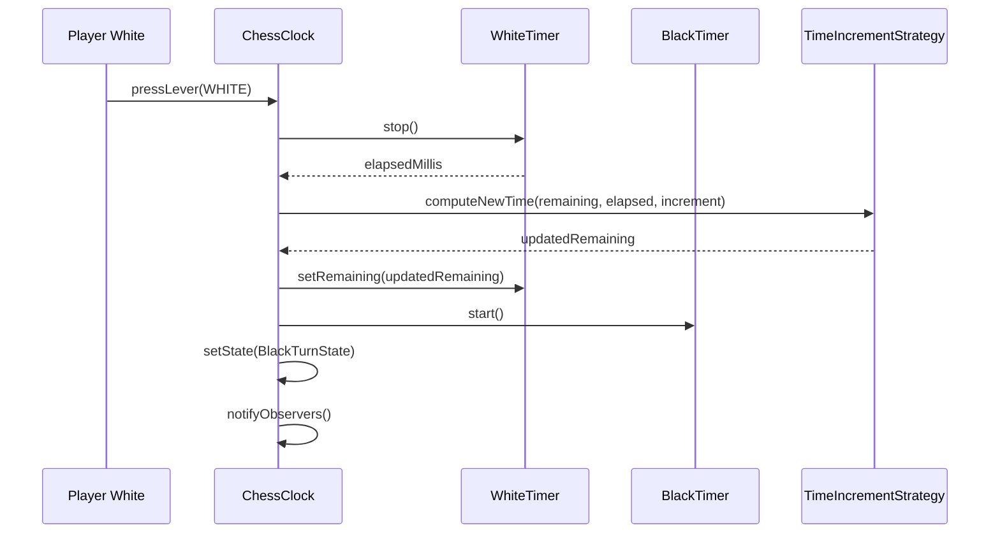

# Low Level Design (LLD): Chess Clock

> **Category**: State / Behavioral  
> **Difficulty**: Easy  
> **Primary Design Patterns**: State Pattern (Running, Paused, Flagged), Observer Pattern (Time tick and flag alerts), Strategy (Delay modes: Fischer, Bronstein, Simple)

---

## 1. Actors & Use Cases

### 1.1 Actors
- **Player 1 & Player 2**: press clock lever
- **Arbiter / Referee**: pause/adjust time
- **Display Board**: subscribes to time ticks

### 1.2 Core Use Cases
- Configure time control (e.g. 3 min + 2s Fischer increment)
- Start clock with initial White turn
- Player switches turn: stop current clock, apply increment, start opponent clock
- Pause match on arbiter demand
- Detect flag falling (time expired = 0) and declare loss

---

## 2. Class Diagram



---

## 3. Key Interfaces & Abstractions

- `ClockObserver`: `onTick(PlayerColor color, long remainingMs)` and `onFlagFell(PlayerColor loser)`.
- `TimeIncrementStrategy`: Encapsulates timing arithmetic across classical, Fischer, and Bronstein systems.

---

## 4. Design Patterns Applied

- **State Pattern**: Coordinates active player timer vs paused/flagged match status.
- **Strategy Pattern**: Encapsulates Fischer vs Bronstein vs Simple time increments.
- **Observer Pattern**: Dispatches tick countdown and flag alert notifications to display components.

---

## 5. Sequence Diagram (Key Execution Flow)



---

## 6. Data Model & Storage Strategy

```sql
CREATE TABLE match_clocks (
    match_id VARCHAR(64) PRIMARY KEY,
    white_player_id VARCHAR(64) NOT NULL,
    black_player_id VARCHAR(64) NOT NULL,
    base_time_sec INT NOT NULL,
    increment_sec INT NOT NULL,
    increment_type VARCHAR(32) NOT NULL, -- FISCHER, BRONSTEIN
    white_remaining_ms BIGINT NOT NULL,
    black_remaining_ms BIGINT NOT NULL,
    active_turn VARCHAR(16) NOT NULL, -- WHITE, BLACK, PAUSED, FINISHED
    updated_at TIMESTAMP DEFAULT CURRENT_TIMESTAMP
);
```

---

## 7. Concurrency & Thread Safety Plan

Dedicated background ticker task scheduled at 100ms precision. State transitions synchronize on a monitor lock to prevent simultaneous button slaps during rapid time-troubles (bullet chess).

---

## 8. Failure Modes & Edge Cases

- **Negative time drift**: Precision monotonic clock (`System.nanoTime()`) used instead of wall-clock time.
- **Simultaneous lever clicks**: Lock ensures strict serialize-and-ignore redundant press.

---

## 9. Extensibility Points

- **Armageddon mode**: Asymmetric White (5 min) vs Black (4 min + draw odds) time setup.
- **DGT Electronic Board USB/Bluetooth integration to auto-sync moves with physical pieces.**: DGT Electronic Board USB/Bluetooth integration to auto-sync moves with physical pieces.
