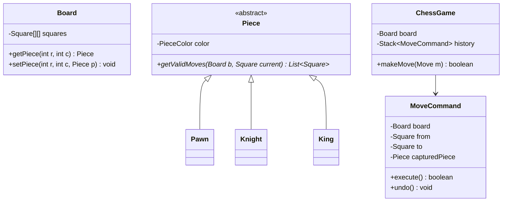
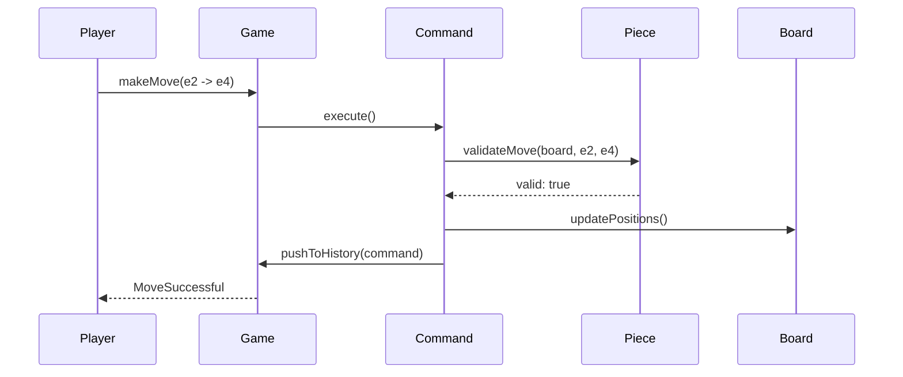

# Low Level Design (LLD): Chess Game

> **Category**: OOD / Game  
> **Difficulty**: Hard  
> **Primary Design Patterns**: Factory Method (Piece instantiation), Command Pattern (Move execution, undo, and replay), Strategy (Move validation per piece)

---

## 1. Actors & Use Cases

### 1.1 Actors
- **White Player**: White Player
- **Black Player**: Black Player
- **Engine / Arbiter**: Engine / Arbiter

### 1.2 Core Use Cases
- Validate legal piece movement (Knight jump, Pawn en passant, Castling)
- Check, Checkmate, and Stalemate detection
- Pawn promotion workflow
- Command-based move history with undo/redo capability

---

## 2. Class Diagram

---

## 3. Key Interfaces & Abstractions

- `Command`: `execute()` and `undo()` for every chess move.

---

## 4. Design Patterns Applied

- Command pattern makes move logging, replay, and undo trivial.
- Factory method builds initial 32-piece board configuration.

---

## 5. Sequence Diagram (Key Execution Flow)

---

## 6. Data Model & Storage Strategy

Table `chess_matches` (pgn_notation, fen_state, current_turn).

---

## 7. Concurrency & Thread Safety Plan

Single lock on active match to guarantee sequential moves and prevent simultaneous out-of-turn play.

---

## 8. Failure Modes & Edge Cases

- **King left in check**: Validation catches pinned pieces and rejects move.

---

## 9. Extensibility Points

- **Stockfish engine UCI protocol integration for AI opponent analysis.**: Stockfish engine UCI protocol integration for AI opponent analysis.
