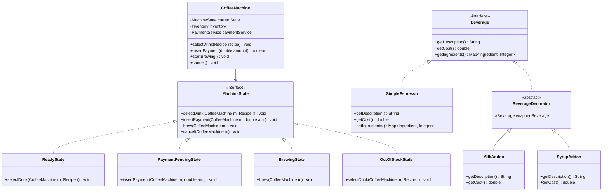
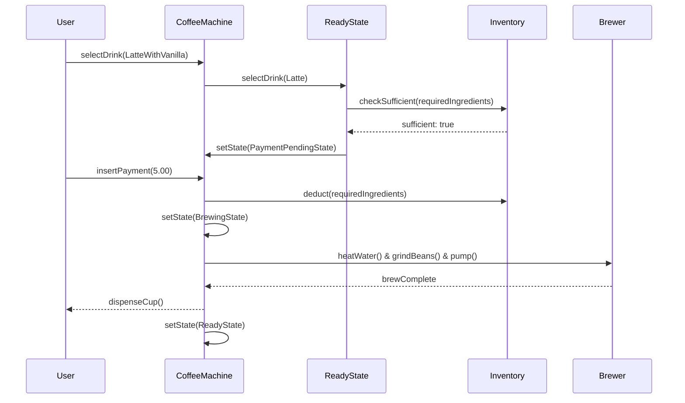

# Low Level Design (LLD): Coffee Machine

> **Category**: State / Behavioral  
> **Difficulty**: Easy  
> **Primary Design Patterns**: State Pattern (Machine cycles), Factory Pattern (Drink creation), Decorator Pattern (Add-ons / Condiments)

---

## 1. Actors & Use Cases

### 1.1 Actors
- **Customer**: selects drink, adds milk/syrups, pays
- **Technician**: refills ingredients, cleans nozzles

### 1.2 Core Use Cases
- Select base beverage (Espresso, Americano, Latte, Cappuccino)
- Customize condiments (Extra shot, Oat milk, Caramel drizzle)
- Check and deduct inventory levels (Water, Milk, Coffee beans, Cups)
- Process brewing state cycle safely with temperature feedback
- Alert maintenance when ingredients reach low threshold

---

## 2. Class Diagram



---

## 3. Key Interfaces & Abstractions

- `MachineState`: Transitions across `Ready`, `PaymentPending`, `Brewing`, and `Maintenance`.
- `Beverage`: Cost and ingredient aggregation interface.

---

## 4. Design Patterns Applied

- **State Pattern**: Controls workflow and prevents illegal user actions (e.g. paying while brewing).
- **Decorator Pattern**: Dynamically composes drink customizations (Espresso + Steamed Milk + Vanilla Syrup) without class explosion.
- **Singleton Pattern**: Hardware controller abstraction managing valves and heaters.

---

## 5. Sequence Diagram (Key Execution Flow)



---

## 6. Data Model & Storage Strategy

```sql
CREATE TABLE ingredients (
    ingredient_id VARCHAR(32) PRIMARY KEY,
    name VARCHAR(64) NOT NULL,
    current_quantity_ml INT NOT NULL,
    threshold_quantity_ml INT NOT NULL,
    unit VARCHAR(16) NOT NULL
);

CREATE TABLE drink_recipes (
    recipe_id VARCHAR(32) PRIMARY KEY,
    name VARCHAR(64) NOT NULL,
    base_price DECIMAL(6,2) NOT NULL
);

CREATE TABLE recipe_ingredients (
    recipe_id VARCHAR(32) REFERENCES drink_recipes(recipe_id),
    ingredient_id VARCHAR(32) REFERENCES ingredients(ingredient_id),
    quantity_required INT NOT NULL,
    PRIMARY KEY(recipe_id, ingredient_id)
);
```

---

## 7. Concurrency & Thread Safety Plan

Shared inventory map operations guarded with `ReentrantLock` or atomic counters (`AtomicInteger`) to prevent race conditions during concurrent ingredient checks and multi-nozzle pours.

---

## 8. Failure Modes & Edge Cases

- **Ingredient runs out mid-brew**: Transactional inventory rollback, display fault code, and initiate refund.
- **Temperature probe sensor failure**: Auto-shutoff thermal fuse triggered to prevent boiler damage.

---

## 9. Extensibility Points

- **Contactless Mobile App / QR code ordering**: REST/WebSocket command integration.
- **Predictive restocking**: Telemetry events emitted to supply chain ERP when beans hit critical reserve.
