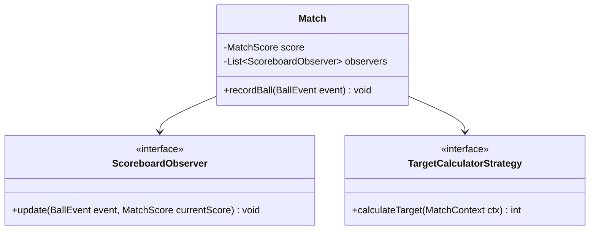
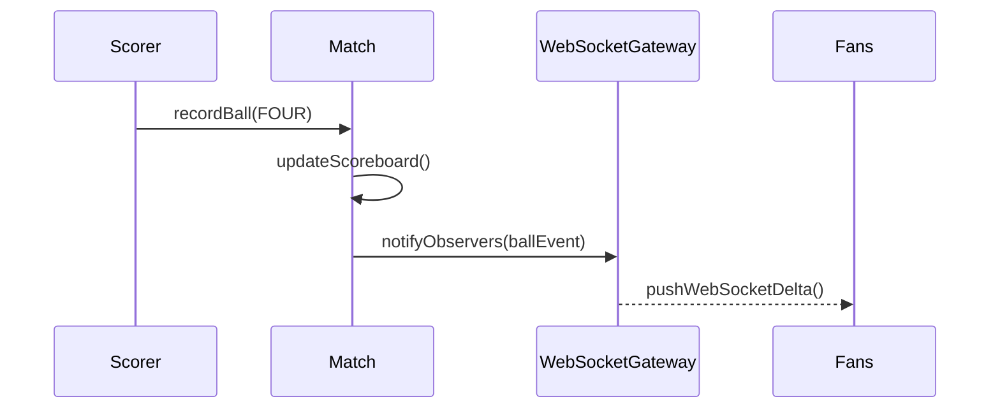

# Low Level Design (LLD): Cricbuzz (Live Cricket Score)

> **Category**: Publisher / Subscriber  
> **Difficulty**: Medium  
> **Primary Design Patterns**: Observer (Pub-Sub score updates), Strategy (Run rate calculation / DLS method), Factory (Match type creation: T20, ODI, Test)

---

## 1. Actors & Use Cases

### 1.1 Actors
- **Scorer / Match Official**: Scorer / Match Official
- **Subscriber / Fan**: Mobile app
- **Commentary Engine**: Commentary Engine

### 1.2 Core Use Cases
- Ball-by-ball event injection (runs, wickets, extras, reviews)
- Real-time fan notification broadcasting
- Dynamic Duckworth-Lewis-Stern target calculation
- Player batting/bowling statistics aggregation

---

## 2. Class Diagram

---

## 3. Key Interfaces & Abstractions

- `ScoreboardObserver`: Broadcasts to WebSocket push servers, TV overlays, and analytics sinks.

---

## 4. Design Patterns Applied

- Observer pattern fans out updates to thousands of connected clients.
- Strategy pattern calculates target across different weather/interruption rules.

---

## 5. Sequence Diagram (Key Execution Flow)

---

## 6. Data Model & Storage Strategy

Tables `matches`, `innings`, `balls` (ball_id, bowler_id, batsman_id, runs, is_wicket, commentary).

---

## 7. Concurrency & Thread Safety Plan

Write events serialized per match using a single-writer partition queue (Kafka/Disruptor). Read traffic served off Redis cache replicas.

---

## 8. Failure Modes & Edge Cases

- **Scorer misclick / DRS reversal**: `undoBall()` event broadcast with compensating state rollback.

---

## 9. Extensibility Points

- **Predictive AI model calculating win probability after every delivery.**: Predictive AI model calculating win probability after every delivery.
