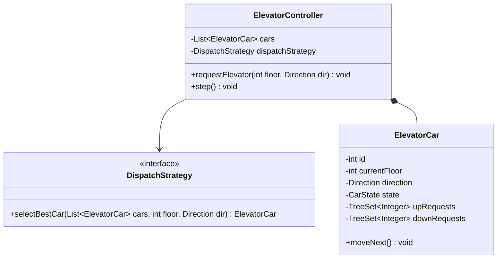
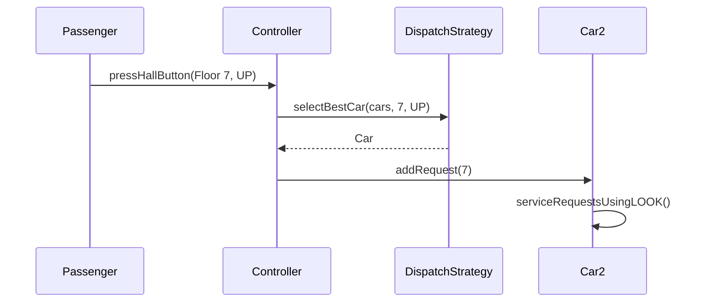

# Low Level Design (LLD): Elevator System

> **Category**: System Design / State  
> **Difficulty**: Hard  
> **Primary Design Patterns**: State Pattern (Elevator Car: MovingUp, MovingDown, Idle, Maintenance), Strategy (Dispatch algorithm: SCAN, LOOK, Destination Dispatch)

---

## 1. Actors & Use Cases

### 1.1 Actors
- **Passenger**: Passenger
- **Hall Call Button**: Hall Call Button
- **Car Panel**: Car Panel
- **Elevator Dispatcher**: Elevator Dispatcher

### 1.2 Core Use Cases
- Internal destination floor button presses
- External up/down corridor requests
- Optimal elevator selection by dispatcher
- Emergency stop and weight overload sensing

---

## 2. Class Diagram

---

## 3. Key Interfaces & Abstractions

- `DispatchStrategy`: Implements LOOK or destination dispatch heuristics.

---

## 4. Design Patterns Applied

- State pattern handles movement transitions and door cycles.
- Strategy pattern swaps elevator assignment algorithms.

---

## 5. Sequence Diagram (Key Execution Flow)

---

## 6. Data Model & Storage Strategy

In-memory real-time state machine with telemetry logs written to database.

---

## 7. Concurrency & Thread Safety Plan

Concurrent queue of requests per car guarded with lock synchronization.

---

## 8. Failure Modes & Edge Cases

- **Overweight sensor triggered**: Car sounds buzzer and refuses to close doors until load drops below threshold.

---

## 9. Extensibility Points

- **VIP priority mode and energy-regenerative braking analytics.**: VIP priority mode and energy-regenerative braking analytics.
