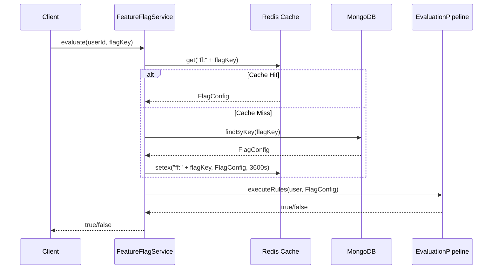

# Low Level Design (LLD): Feature Flag Evaluation Engine

> **Category**: Infrastructure / Decision Engine  
> **Difficulty**: Hard  
> **Primary Design Patterns**: Strategy Pattern (Evaluation rules), Factory Pattern (Integration handlers), Observer Pattern (Cache invalidation)

---

## 1. Actors & Use Cases

### 1.1 Actors
- **Client Application / Frontend**: Requests feature status for a specific user and flag key.
- **Admin / Product Manager**: Toggles flags, sets percentage rollouts, modifies whitelist rules.
- **Billing / Subscription Worker**: Triggers permission changes on user upgrade/downgrade.

### 1.2 Core Use Cases
- High-throughput sub-millisecond evaluation (`evaluate(userId, flagKey) -> boolean`).
- Rule pipeline execution: Global kill-switch -> Admin bypass -> Subscription tier check -> Deterministic percentage rollout.
- Multi-tier cache lookup (L1 In-Memory Guava/Caffeine -> L2 Redis -> L3 MongoDB).
- Real-time cache invalidation upon configuration mutations.

---

## 2. Class Diagram

```mermaid
classDiagram
    class FeatureFlagController {
        -FeatureFlagService flagService
        +evaluateFlag(String userId, String flagKey) ResponseEntity~Boolean~
        +createFlag(CreateFlagRequest request) ResponseEntity~FeatureFlag~
    }
    class FeatureFlagService {
        <<interface>>
        +evaluate(String userId, String flagKey) boolean
        +invalidateCache(String flagKey) void
    }
    class FeatureFlagServiceImpl {
        -FeatureFlagRepository flagRepo
        -RedisTemplate redisTemplate
        -List~EvaluationRule~ rules
        +evaluate(String userId, String flagKey) boolean
    }
    class EvaluationRule {
        <<interface>>
        +evaluate(User user, FeatureFlag flag) EvaluationResult
    }
    class GlobalStatusRule {
        +evaluate(User user, FeatureFlag flag) EvaluationResult
    }
    class UserRoleRule {
        +evaluate(User user, FeatureFlag flag) EvaluationResult
    }
    class SubscriptionTierRule {
        +evaluate(User user, FeatureFlag flag) EvaluationResult
    }
    class PercentageRolloutRule {
        -HashFunction hasher
        +evaluate(User user, FeatureFlag flag) EvaluationResult
    }

    FeatureFlagController --> FeatureFlagService
    FeatureFlagServiceImpl ..|> FeatureFlagService
    FeatureFlagServiceImpl --> EvaluationRule : executes pipeline of
    GlobalStatusRule ..|> EvaluationRule
    UserRoleRule ..|> EvaluationRule
    SubscriptionTierRule ..|> EvaluationRule
    PercentageRolloutRule ..|> EvaluationRule
```



---

## 3. Key Interfaces & Abstractions

- `EvaluationRule`: `evaluate(User user, FeatureFlag flag) -> EvaluationResult` allows plugging custom evaluation conditions without modifying the core service.
- `FeatureFlagService`: Decouples business callers from Redis and MongoDB persistence layers.

---

## 4. Design Patterns Applied

- **Strategy Pattern (`EvaluationRule`)**: Encapsulates rule conditions (Global status, Role, Subscription tier, Consistent hash percentage rollout) as interchangeable components.
- **Chain / Pipeline Pattern**: Orchestrates ordered rule progression: failure at any gate halts evaluation immediately (fail-fast).
- **Observer Pattern**: Event listeners subscribe to subscription billing and admin mutations to invalidate distributed Redis caches.

---

## 5. Sequence Diagram (Key Execution Flow)



---

## 6. Data Model & Storage Strategy

```sql
-- MongoDB Document Schema representation
{
  "_id": "ObjectId",
  "flagKey": "lld_interactive_runner",
  "name": "Interactive Code Runner for LLD",
  "isEnabled": true,
  "isArchived": false,
  "allowedRoles": ["ADMIN", "PREMIUM_USER"],
  "rolloutPercentage": 50,
  "minSubscriptionTier": "PRO",
  "rules": [
    { "attribute": "country", "operator": "IN", "values": ["US", "IN", "GB"] }
  ],
  "updatedAt": "2026-09-14T00:00:00Z"
}
```

---

## 7. Concurrency & Thread Safety Plan

Evaluations are strictly read-only and lock-free. Cache writes use atomic Redis operations (`GET` / `SETEX`). In-memory cache invalidation uses Redis Pub/Sub topic to broadcast eviction to all running microservice instances.

---

## 8. Failure Modes & Edge Cases

- **Redis unreachable**: Service transparently falls back to local in-memory caffeine cache and MongoDB with circuit breaker (Resilience4j).
- **Flag not found**: Default fallback value (`false`) returned safely without throwing runtime exceptions.
- **User identifier missing**: Anonymous guest users evaluate strictly against public global rules.

---

## 9. Extensibility Points

- **A/B Experimentation Engine**: Extend rules with multivariate variant allocation (Variant A, B, C) and exposure event tracking.
- **Edge Evaluation**: Compile rules into WebAssembly / Cloudflare Workers for client-side zero-latency evaluation.
