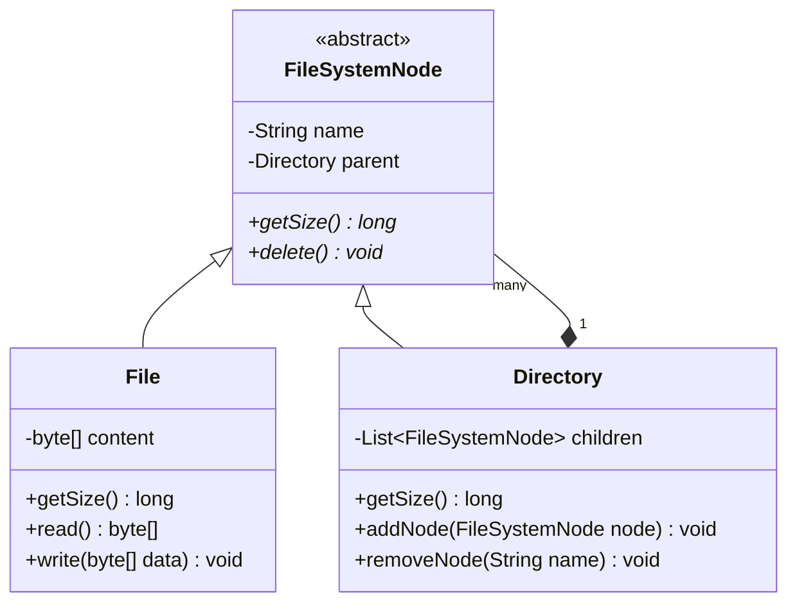
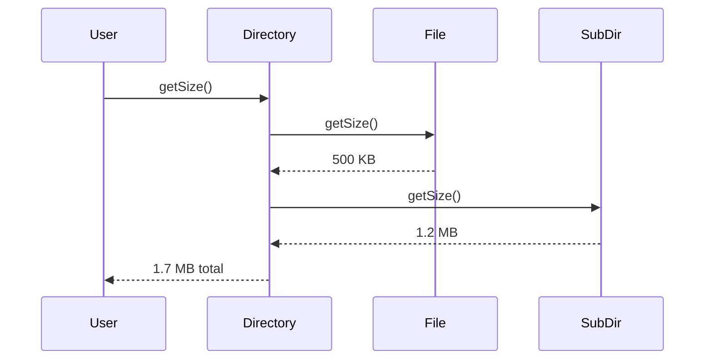

# Low Level Design (LLD): File System

> **Category**: Structural Design  
> **Difficulty**: Medium  
> **Primary Design Patterns**: Composite Pattern (Hierarchical Files and Directories), Command Pattern (Undoable fs operations), Iterator (Directory traversal)

---

## 1. Actors & Use Cases

### 1.1 Actors
- **User / Shell CLI**: User / Shell CLI
- **Operating System Kernal**: Operating System Kernal

### 1.2 Core Use Cases
- Create/delete files and directories (`mkdir`, `touch`, `rm`)
- Recursive path resolution (`/usr/local/bin`)
- File read/write with content streaming
- Calculate size recursively (Composite pattern)

---

## 2. Class Diagram

---

## 3. Key Interfaces & Abstractions

- `FileSystemNode`: Common uniform interface for files and directories.

---

## 4. Design Patterns Applied

- Composite pattern treats individual files and compound folders identically.
- Command pattern encapsulates file operations allowing undo/redo.

---

## 5. Sequence Diagram (Key Execution Flow)

---

## 6. Data Model & Storage Strategy

Tree hierarchy in memory or Inode table with pointer blocks on disk.

---

## 7. Concurrency & Thread Safety Plan

ReadWriteLock per Directory inode to allow simultaneous file reads while locking on creation/deletion.

---

## 8. Failure Modes & Edge Cases

- **Circular symlink loops**: Traversal depth limit and visited Inode set guard against stack overflows.

---

## 9. Extensibility Points

- **Permission control lists (ACL**: read, write, execute) and journaling for crash recovery.
