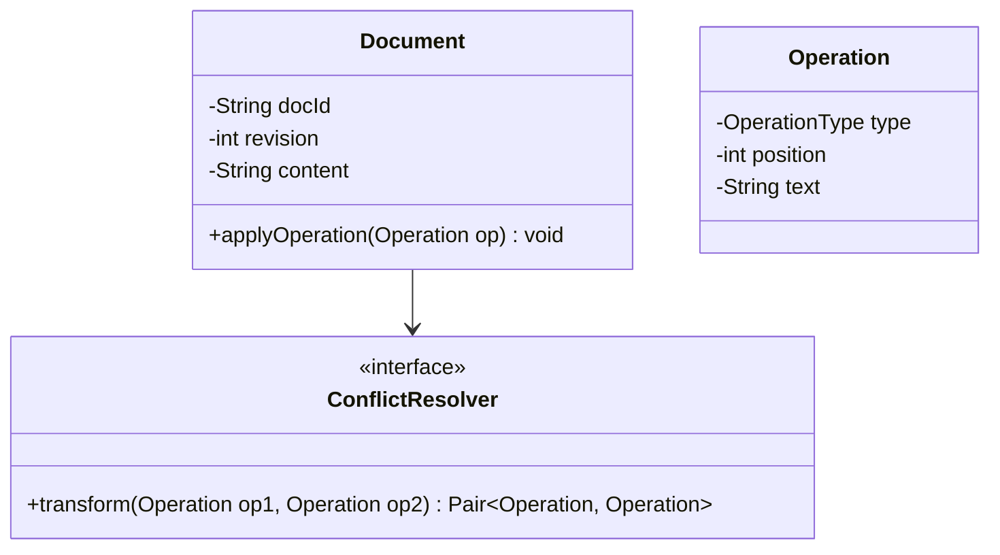
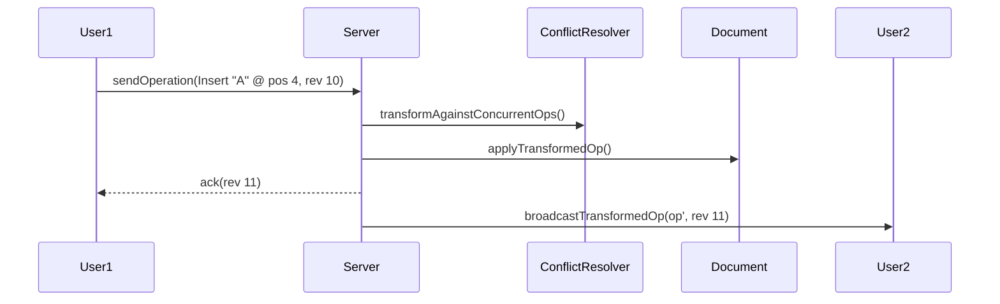

# Low Level Design (LLD): Google Docs

> **Category**: Concurrency / Realtime  
> **Difficulty**: Hard  
> **Primary Design Patterns**: Command Pattern (Document editing operations), Observer (Collaborator broadcast), Strategy (Operational Transformation / CRDT conflict resolution)

---

## 1. Actors & Use Cases

### 1.1 Actors
- **Collaborator / User**: Collaborator / User
- **Sync Server**: Sync Server
- **Document Store**: Document Store

### 1.2 Core Use Cases
- Concurrent real-time document editing
- Operational Transformation (OT) or Conflict-free Replicated Data Types (CRDT)
- Cursor presence tracking for multi-users
- Version history snapshots and revision rollback

---

## 2. Class Diagram

---

## 3. Key Interfaces & Abstractions

- `ConflictResolver`: Transforms concurrent operations based on revision indices.

---

## 4. Design Patterns Applied

- Command pattern represents insert/delete operations.
- Observer pattern fans out transformed operations to connected WebSocket peers.

---

## 5. Sequence Diagram (Key Execution Flow)

---

## 6. Data Model & Storage Strategy

Document snapshot store + Append-only Operation Log (`operations` table).

---

## 7. Concurrency & Thread Safety Plan

Server-side single-threaded actor or state machine per document ordering revisions monotonically.

---

## 8. Failure Modes & Edge Cases

- **Client disconnects**: Resync protocol transmits missing operations since client's last recognized revision.

---

## 9. Extensibility Points

- **Rich text formatting annotations and document commenting threads.**: Rich text formatting annotations and document commenting threads.
