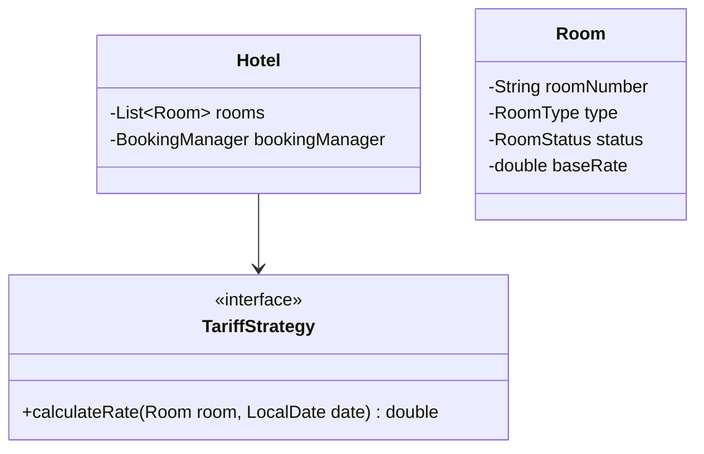
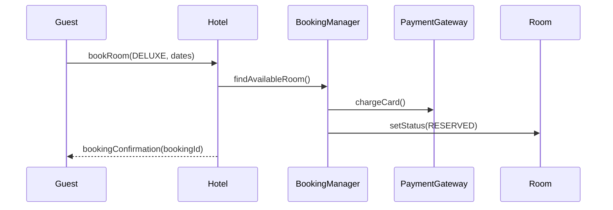

# Low Level Design (LLD): Hotel Management

> **Category**: Transactional / OOD  
> **Difficulty**: Hard  
> **Primary Design Patterns**: Factory (Room type creation), Observer (Housekeeping and Booking notifications), Strategy (Seasonal dynamic tariff)

---

## 1. Actors & Use Cases

### 1.1 Actors
- **Guest**: Guest
- **Receptionist**: Receptionist
- **Housekeeping Staff**: Housekeeping Staff
- **Manager**: Manager

### 1.2 Core Use Cases
- Room inventory search (Standard, Deluxe, Suite, Penthouse)
- Reservation booking with advance deposit
- Check-in with electronic keycard issuance
- Housekeeping status update (Clean, Dirty, Under Maintenance)
- Checkout with room service billing

---

## 2. Class Diagram

---

## 3. Key Interfaces & Abstractions

- `TariffStrategy`: Dynamically prices based on weekend, holiday, and occupancy %.

---

## 4. Design Patterns Applied

- Observer pattern updates housekeeping dashboard when guest checks out.
- Factory pattern manages room configurations.

---

## 5. Sequence Diagram (Key Execution Flow)

---

## 6. Data Model & Storage Strategy

Tables `hotels`, `rooms`, `bookings`, `room_charges`.

---

## 7. Concurrency & Thread Safety Plan

Database date-range overlap constraint (`EXCLUDE USING gist`) prevents double bookings for overlapping dates.

---

## 8. Failure Modes & Edge Cases

- **Overbooking tolerance**: Algorithmic capacity buffer with automatic partner-hotel upgrade.

---

## 9. Extensibility Points

- **Smart IoT room controls (thermostat, lights, door lock integration).**: Smart IoT room controls (thermostat, lights, door lock integration).
