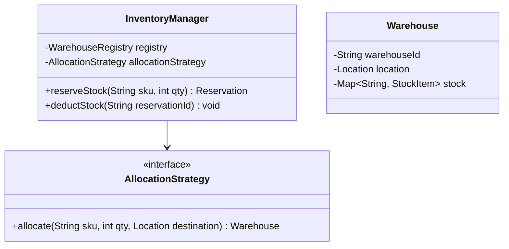
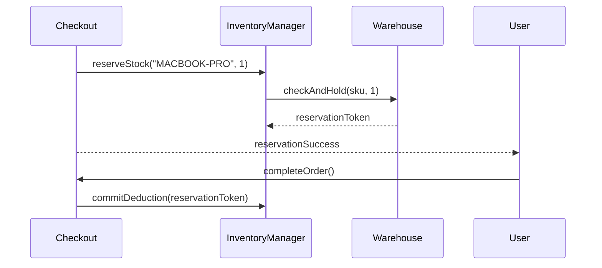

# Low Level Design (LLD): Distributed Inventory System

> **Category**: Transactional / OOD  
> **Difficulty**: Hard  
> **Primary Design Patterns**: Strategy (Inventory allocation: FIFO, Nearest Warehouse), Observer (Restock threshold triggers), Command (Inventory adjustments)

---

## 1. Actors & Use Cases

### 1.1 Actors
- **E-Commerce Checkout**: E-Commerce Checkout
- **Warehouse Staff**: Warehouse Staff
- **Procurement Manager**: Procurement Manager

### 1.2 Core Use Cases
- Real-time SKU stock tracking across multiple warehouses
- Soft reservation during checkout (hold for 15 min)
- Hard deduction upon order fulfillment
- Automated purchase order trigger on stock replenishment threshold
- Returns and restocking processing

---

## 2. Class Diagram

---

## 3. Key Interfaces & Abstractions

- `AllocationStrategy`: Optimizes logistics cost and shipping transit time.

---

## 4. Design Patterns Applied

- Strategy pattern chooses optimal warehouse.
- Observer pattern triggers procurement orders on low inventory levels.

---

## 5. Sequence Diagram (Key Execution Flow)

---

## 6. Data Model & Storage Strategy

Tables `warehouses`, `products`, `warehouse_stock`, `stock_reservations`.

---

## 7. Concurrency & Thread Safety Plan

Atomic decrements using Redis Lua script or database `UPDATE warehouse_stock SET available = available - QTY WHERE available >= QTY`.

---

## 8. Failure Modes & Edge Cases

- **Flash sale overselling**: Pre-allocated inventory redis counters ensure zero stock oversubscription.

---

## 9. Extensibility Points

- **Lot and expiration date tracking for pharmaceutical and perishable goods.**: Lot and expiration date tracking for pharmaceutical and perishable goods.
