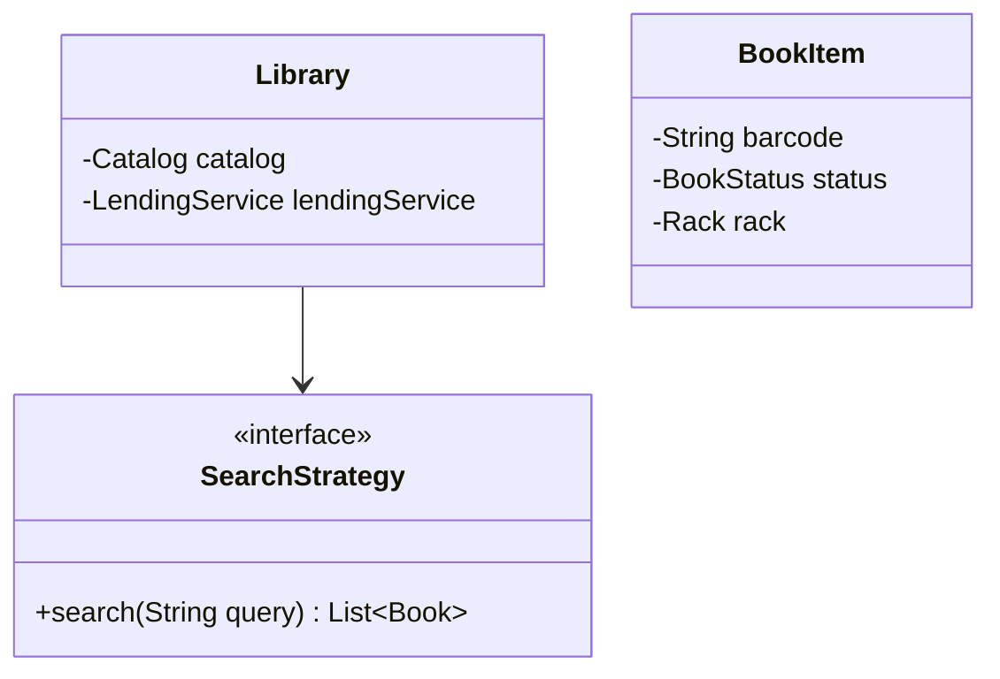
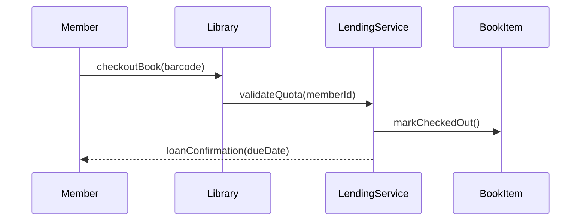

# Low Level Design (LLD): Library Management System

> **Category**: CRUD / OOD  
> **Difficulty**: Medium  
> **Primary Design Patterns**: Factory (Member/Book creation), Strategy (Search by title, author, ISBN), Observer (Fine & Reserve alerts)

---

## 1. Actors & Use Cases

### 1.1 Actors
- **Member / Student**: Member / Student
- **Librarian**: Librarian
- **Notification System**: Notification System

### 1.2 Core Use Cases
- Book search by multi-criteria
- Issue book with lending quota validation
- Return book and compute overdue fines
- Reserve currently checked-out book

---

## 2. Class Diagram

---

## 3. Key Interfaces & Abstractions

- `SearchStrategy`: `search(String query) -> List<Book>`
- `FineCalculator`: `calculateFine(int overdueDays) -> double`

---

## 4. Design Patterns Applied

- Strategy pattern for flexible catalog queries (Elasticsearch vs SQL vs Trie).
- Observer pattern for reservation availability alerts.

---

## 5. Sequence Diagram (Key Execution Flow)

---

## 6. Data Model & Storage Strategy

Tables `books`, `book_copies`, `loans`, `reservations` with indexed foreign keys.

---

## 7. Concurrency & Thread Safety Plan

Pessimistic lock on `book_copies` row to avoid concurrent checkouts of the single physical copy.

---

## 8. Failure Modes & Edge Cases

- **Late returns**: Cron job automatically moves loan into OVERDUE and freezes borrowing privileges.

---

## 9. Extensibility Points

- **Digital e-book licensing with time-based DRM license revoking.**: Digital e-book licensing with time-based DRM license revoking.
