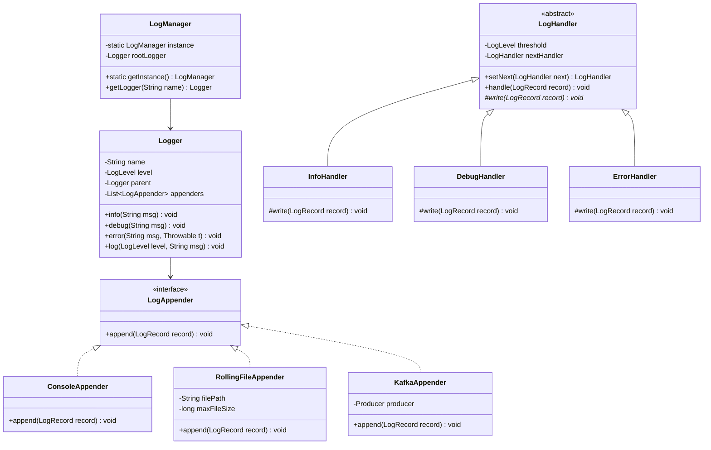
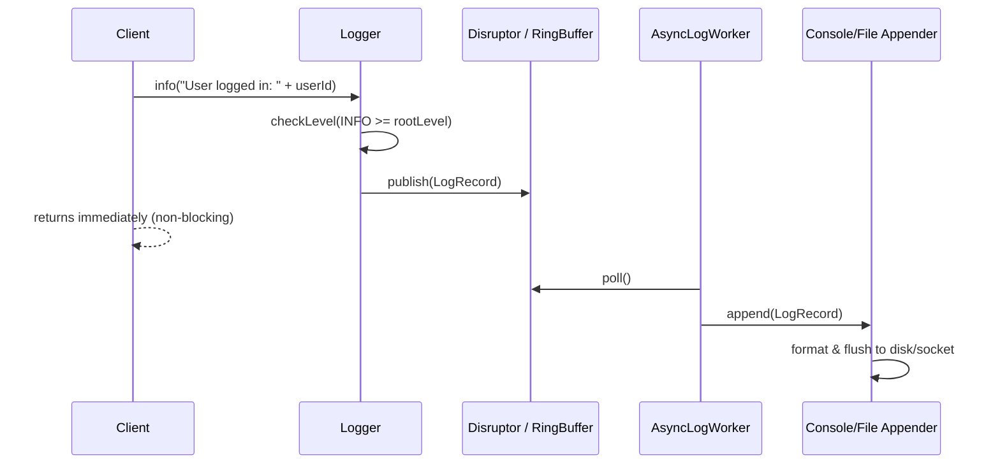

# Low Level Design (LLD): Logger Framework

> **Category**: Behavioral  
> **Difficulty**: Easy  
> **Primary Design Patterns**: Chain of Responsibility (Log level filtering), Singleton (LogManager), Observer / Strategy (Log Appenders/Sinks)

---

## 1. Actors & Use Cases

### 1.1 Actors
- **Application Client**: invokes info, debug, error
- **Log Appenders**: Console, Rolling File, Kafka, Database

### 1.2 Core Use Cases
- Log formatted message at levels: TRACE, DEBUG, INFO, WARN, ERROR, FATAL
- Propagate message down handler chain based on root threshold
- Route log message to multiple sinks concurrently without blocking application thread
- Support dynamic log level changes at runtime without restarting

---

## 2. Class Diagram



---

## 3. Key Interfaces & Abstractions

- `LogAppender`: `append(LogRecord record) -> void` decouples destination sink.
- `LogFormatter`: `format(LogRecord record) -> String` produces JSON, XML, or Text formats.

---

## 4. Design Patterns Applied

- **Chain of Responsibility**: Handlers check severity against their threshold before delegating to subsequent level handlers.
- **Singleton**: `LogManager` maintains hierarchy of named loggers (`com.beingsde.core`).
- **Strategy / Bridge**: `LogFormatter` and `LogAppender` allow orthogonal choice of layout and destination.

---

## 5. Sequence Diagram (Key Execution Flow)



---

## 6. Data Model & Storage Strategy

```sql
-- For DB logging sink
CREATE TABLE application_logs (
    log_id UUID PRIMARY KEY,
    logger_name VARCHAR(255) NOT NULL,
    log_level VARCHAR(16) NOT NULL,
    message TEXT NOT NULL,
    exception_stack TEXT,
    thread_name VARCHAR(64),
    host_ip VARCHAR(64),
    created_at TIMESTAMP DEFAULT CURRENT_TIMESTAMP
);
CREATE INDEX idx_logs_timestamp ON application_logs(created_at DESC);
CREATE INDEX idx_logs_level ON application_logs(log_level, created_at DESC);
```

---

## 7. Concurrency & Thread Safety Plan

LMAX Disruptor ring buffer or `ArrayBlockingQueue` enables lock-free asynchronous logging so business threads are never held up by slow I/O or disk flushes.

---

## 8. Failure Modes & Edge Cases

- **Disk full / Network partition on remote appender**: Ring buffer drops logs or writes to local stderr fallback without crashing the host app.
- **Deadlock in appender**: Appender avoids locks shared with caller application.

---

## 9. Extensibility Points

- **Distributed Tracing (MDC)**: Attach `traceId` and `spanId` to the thread-local context automatically.
- **Dynamic hot-reloading**: Observe JMX or configuration endpoint to alter log level on the fly.
