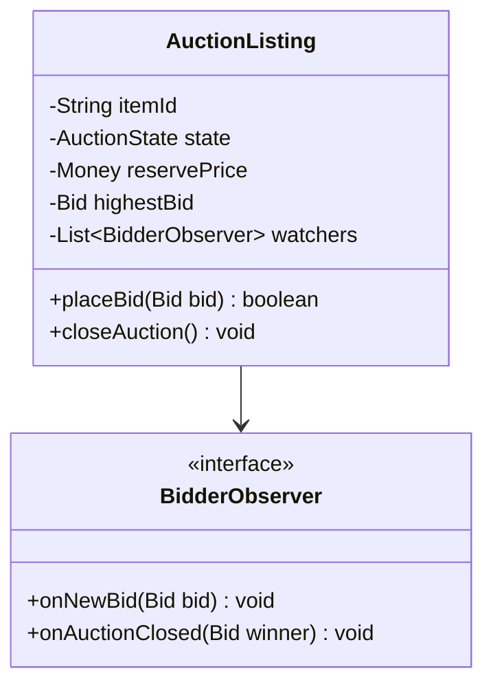
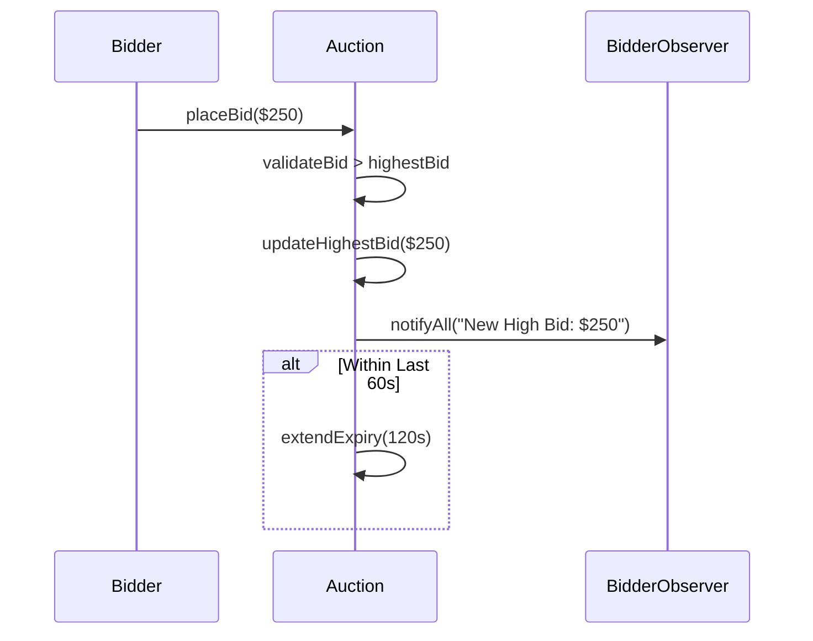

# Low Level Design (LLD): Online Auction System

> **Category**: Publisher / Subscriber  
> **Difficulty**: Medium  
> **Primary Design Patterns**: Observer (Bid alerts & price tickers), State Pattern (Auction Lifecycle: Created, Active, Closed, Settled), Mediator (Auctioneer orchestrator)

---

## 1. Actors & Use Cases

### 1.1 Actors
- **Seller**: Seller
- **Bidder**: Bidder
- **Auctioneer Engine**: Auctioneer Engine
- **Payment Gateway**: Payment Gateway

### 1.2 Core Use Cases
- List item with reserve price and expiration deadline
- Place bid higher than current highest bid + minimum increment
- Live broadcasting of incoming bids to watching bidders
- Auto-sniping extension (extend auction by 2 min if bid placed in last 60s)
- Closing auction and charging winner

---

## 2. Class Diagram

---

## 3. Key Interfaces & Abstractions

- `BidderObserver`: Live updates pushed via WebSockets.

---

## 4. Design Patterns Applied

- Observer pattern keeps all active auction screens synchronized in real-time.
- State pattern enforces strict transitions from active to expired.

---

## 5. Sequence Diagram (Key Execution Flow)

---

## 6. Data Model & Storage Strategy

Tables `auctions`, `bids` (bid_id, auction_id, bidder_id, amount, placed_at).

---

## 7. Concurrency & Thread Safety Plan

Pessimistic database locking (`FOR UPDATE`) or Redis Lua script to process bids sequentially without race conditions.

---

## 8. Failure Modes & Edge Cases

- **Winner payment fails**: Cascade to second-highest bidder (Vickrey auction fallback).

---

## 9. Extensibility Points

- **Proxy Bidding (Automatic max-bid increment bot).**: Proxy Bidding (Automatic max-bid increment bot).
