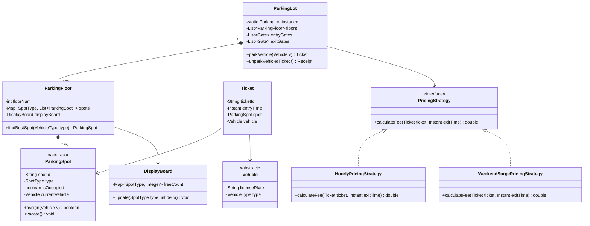
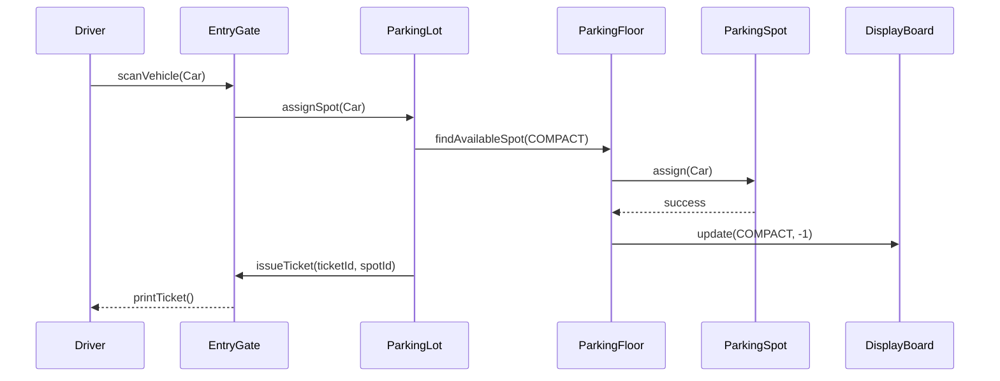

# Low Level Design (LLD): Parking Lot System

> **Category**: Object-Oriented Design  
> **Difficulty**: Medium  
> **Primary Design Patterns**: Singleton (Parking Lot), Factory Method (Spot/Vehicle creation), Strategy (Pricing calculation), Observer (Display board)

---

## 1. Actors & Use Cases

### 1.1 Actors
- **Customer / Driver**: parks and pays
- **Entry / Exit Gate Terminals**: scans vehicle, issues/validates tickets
- **Parking Attendant**: manual override, cash desk

### 1.2 Core Use Cases
- Multi-level floor layout supporting Motorcycle, Compact, Large, and EV spots
- Dynamic allocation of the nearest optimal available spot on entry
- Generate timestamped barcode ticket
- Calculate pricing via flexible strategies (Hourly, Flat, Weekend, EV charging tariff)
- Real-time display board synchronization per floor

---

## 2. Class Diagram



---

## 3. Key Interfaces & Abstractions

- `PricingStrategy`: `calculateFee(Ticket ticket, Instant exitTime) -> double`
- `SpotAssignmentStrategy`: `allocateSpot(List<ParkingFloor> floors, Vehicle v) -> ParkingSpot`

---

## 4. Design Patterns Applied

- **Singleton**: Guarantees single orchestrator managing entire parking real estate.
- **Factory Method**: `VehicleFactory` and `SpotFactory` instantiate concrete types.
- **Strategy**: Dynamic fee schedule decoupled from checkout gates.
- **Observer**: Floors publish spot status changes to digital occupancy boards.

---

## 5. Sequence Diagram (Key Execution Flow)



---

## 6. Data Model & Storage Strategy

```sql
CREATE TABLE parking_spots (
    spot_id VARCHAR(32) PRIMARY KEY,
    floor_number INT NOT NULL,
    spot_type VARCHAR(20) NOT NULL,
    is_occupied BOOLEAN DEFAULT FALSE,
    version INT DEFAULT 0 -- Optimistic lock
);

CREATE TABLE parking_tickets (
    ticket_id VARCHAR(64) PRIMARY KEY,
    license_plate VARCHAR(32) NOT NULL,
    spot_id VARCHAR(32) REFERENCES parking_spots(spot_id),
    entry_time TIMESTAMP NOT NULL,
    exit_time TIMESTAMP,
    fee_paid DECIMAL(8,2),
    status VARCHAR(20) DEFAULT 'ACTIVE' -- ACTIVE, PAID, LOST
);
CREATE INDEX idx_tickets_active ON parking_tickets(license_plate, status);
```

---

## 7. Concurrency & Thread Safety Plan

Spot assignment handles race conditions across gates using database row-level locking (`SELECT ... FOR UPDATE SKIP LOCKED`) or CAS on an in-memory bitmap per floor.

---

## 8. Failure Modes & Edge Cases

- **Lot full**: Gate displays 'FULL', barrier arm locked.
- **Lost ticket**: System falls back to License Plate Recognition (LPR) camera matching entry timestamp or charges maximum default daily fee.

---

## 9. Extensibility Points

- **Automated Valet & Robot Parking shuttles.**: Automated Valet & Robot Parking shuttles.
- **EV Charging station telemetry with kilowatt-hour fee aggregation.**: EV Charging station telemetry with kilowatt-hour fee aggregation.
