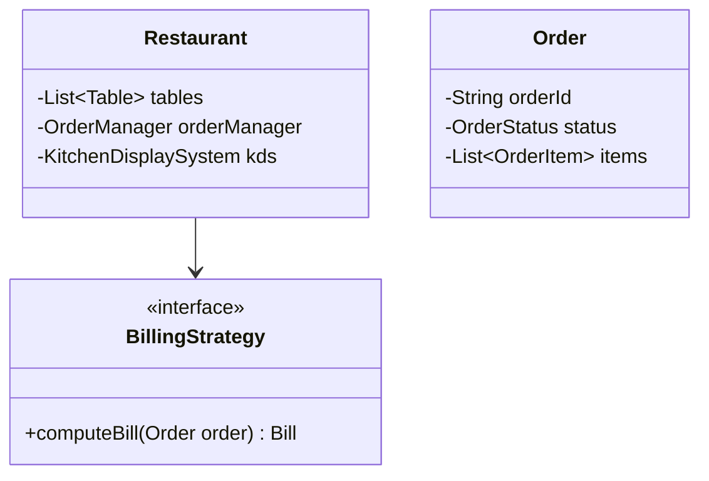
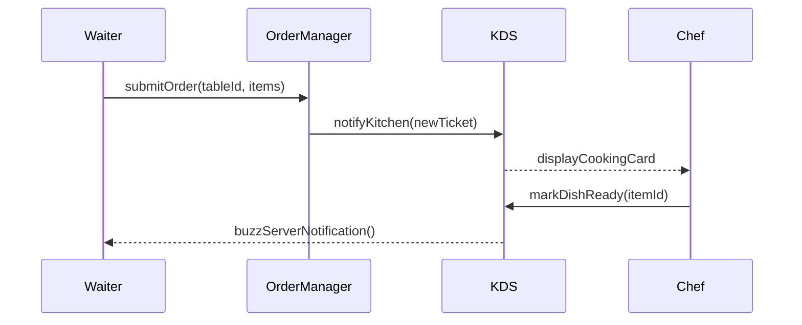

# Low Level Design (LLD): Restaurant Management System

> **Category**: Object-Oriented Design  
> **Difficulty**: Medium  
> **Primary Design Patterns**: Factory (Order item preparation), Observer (Kitchen Display System alerts), Strategy (Bill calculation & discounts)

---

## 1. Actors & Use Cases

### 1.1 Actors
- **Customer**: Customer
- **Waiter / Server**: Waiter / Server
- **Kitchen Chef**: Kitchen Chef
- **Cashier**: Cashier

### 1.2 Core Use Cases
- Table reservation and seated table tracking
- Order placement and real-time Kitchen Display System (KDS) routing
- Inventory deduction upon cooking
- Billing with split payments and tax/service charges

---

## 2. Class Diagram

---

## 3. Key Interfaces & Abstractions

- `BillingStrategy`: Dynamic discounts (Happy Hour, Loyalty points, Corporate voucher).

---

## 4. Design Patterns Applied

- Observer pattern updates Kitchen Display System as new order items are fired.
- Factory pattern creates customized dishes with ingredient alterations.

---

## 5. Sequence Diagram (Key Execution Flow)

---

## 6. Data Model & Storage Strategy

Tables `restaurant_tables`, `orders`, `order_items`, `menu_items`, `bills`.

---

## 7. Concurrency & Thread Safety Plan

Table seating states locked atomically to avoid double-assigning the same dining booth.

---

## 8. Failure Modes & Edge Cases

- **86'd (out of stock) item**: POS blocks ordering instantly and notifies all handheld terminals.

---

## 9. Extensibility Points

- **QR Code digital menu table self-ordering with automated payment.**: QR Code digital menu table self-ordering with automated payment.
