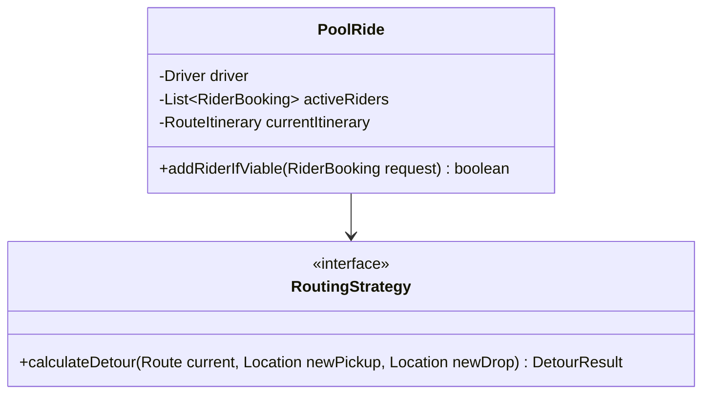
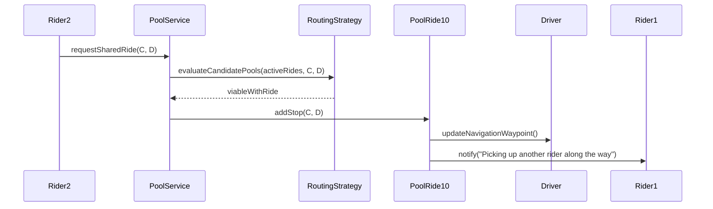

# Low Level Design (LLD): Ride Sharing (Carpooling / Pool)

> **Category**: OOD / Concurrency  
> **Difficulty**: Hard  
> **Primary Design Patterns**: Strategy (Route overlapping & detour optimization), Observer (Dynamic matching & passenger onboard alerts), State Pattern (Shared Vehicle: Empty, PartiallyFilled, Full)

---

## 1. Actors & Use Cases

### 1.1 Actors
- **Commuters**: Commuters
- **Pool Driver**: Pool Driver
- **Batch Matching Dispatcher**: Batch Matching Dispatcher

### 1.2 Core Use Cases
- Match multiple riders headed in the same directional corridor
- Detour time limit constraint validation (e.g. max 10 min detour)
- Dynamic fare splitting based on shared distance ratios
- Real-time pickup and dropoff itinerary re-ordering

---

## 2. Class Diagram

---

## 3. Key Interfaces & Abstractions

- `RoutingStrategy`: Computes marginal travel time and distance impact.

---

## 4. Design Patterns Applied

- Strategy pattern tests dynamic routing permutations.
- Observer pattern sends arrival notifications to each rider.

---

## 5. Sequence Diagram (Key Execution Flow)

---

## 6. Data Model & Storage Strategy

Tables `pool_rides`, `pool_bookings`, `pool_stops` (waypoint_order, estimated_arrival).

---

## 7. Concurrency & Thread Safety Plan

Vehicle seat capacity atomic locks guarantee a carpool vehicle never exceeds 4 passenger seats.

---

## 8. Failure Modes & Edge Cases

- **Rider no-show at pickup pin**: 2-minute driver wait timer triggers auto-cancellation and re-routing.

---

## 9. Extensibility Points

- **Corporate daily commute subscriptions and women-only carpooling pools.**: Corporate daily commute subscriptions and women-only carpooling pools.
