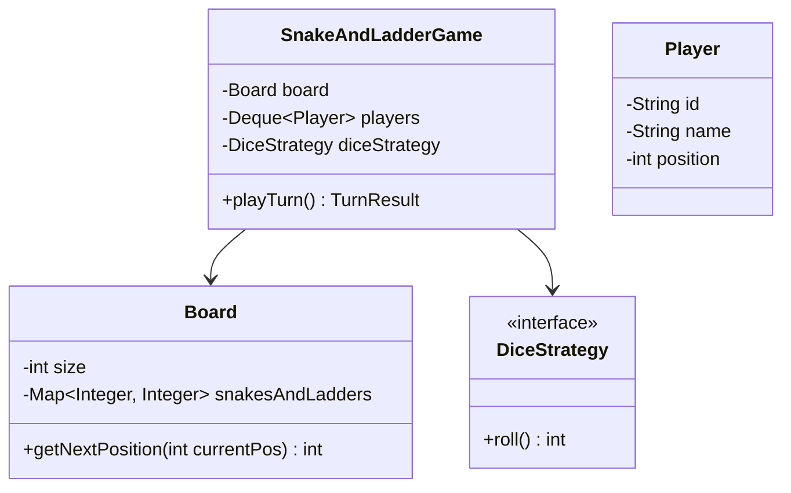
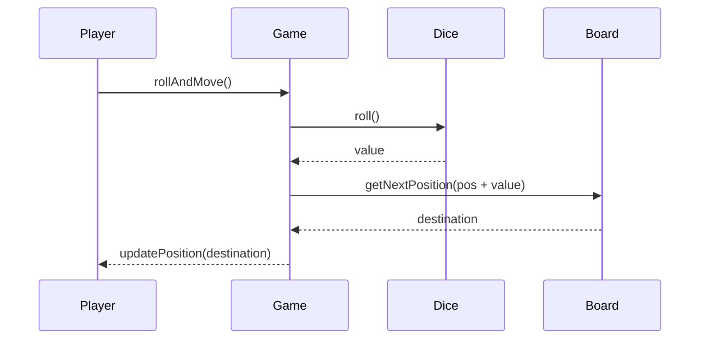

# Low Level Design (LLD): Snake & Ladder

> **Category**: OOD / Game  
> **Difficulty**: Medium  
> **Primary Design Patterns**: Singleton (Game Rules), Strategy (Dice rolling: single, double, crooked), Observer (Move & Event broadcaster)

---

## 1. Actors & Use Cases

### 1.1 Actors
- **Players**: Players
- **Game Controller**: Game Controller
- **Leaderboard**: Leaderboard

### 1.2 Core Use Cases
- Custom board dimensions and customizable snakes/ladders
- Dice roll validation
- Automatic progression up ladders / sliding down snakes
- Win declaration on reaching exact 100

---

## 2. Class Diagram

---

## 3. Key Interfaces & Abstractions

- `DiceStrategy`: `roll() -> int`
- `GameObserver`: `onPlayerMoved(Player p, int from, int to)`

---

## 4. Design Patterns Applied

- Strategy pattern for dice variations (standard 1-6, fair pair, crooked dice).
- Observer pattern for logging match commentary.

---

## 5. Sequence Diagram (Key Execution Flow)

---

## 6. Data Model & Storage Strategy

Table `game_sessions` and `board_entities` (source, destination, type).

---

## 7. Concurrency & Thread Safety Plan

Synchronized turn coordinator ensures turns rotate strictly in sequential order.

---

## 8. Failure Modes & Edge Cases

- **Infinite loop loops (e.g. cycle in snake/ladder setup)**: Graph cycle check on board initialization.

---

## 9. Extensibility Points

- **Multiplayer WebSocket lobby with dynamic power-ups (shields, double rolls).**: Multiplayer WebSocket lobby with dynamic power-ups (shields, double rolls).
