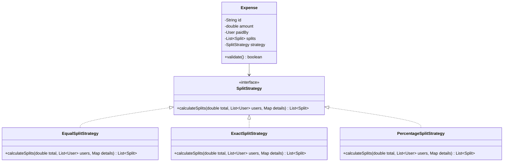
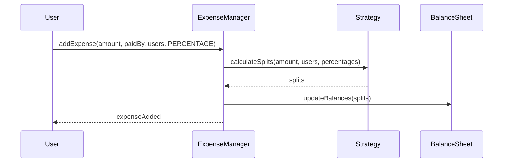

# Low Level Design (LLD): Splitwise (Expense Sharing App)

> **Category**: Object-Oriented Design  
> **Difficulty**: Hard  
> **Primary Design Patterns**: Strategy (Split methods: Exact, Equal, Percentage, Shares), Factory (Expense creation), Observer (Activity feed notifications)

---

## 1. Actors & Use Cases

### 1.1 Actors
- **Group Member**: Group Member
- **Payer**: Payer
- **Expense Manager**: Expense Manager

### 1.2 Core Use Cases
- Add expense split equally, by exact amount, or percentage
- Track pairwise debts across multiple friends and groups
- Simplify group debt using minimum cash flow algorithm
- Record direct settlement transactions

---

## 2. Class Diagram

---

## 3. Key Interfaces & Abstractions

- `SplitStrategy`: Encapsulates validation and split calculation math.

---

## 4. Design Patterns Applied

- Strategy pattern handles diverse splitting algorithms.
- Factory pattern generates expenses from payload.

---

## 5. Sequence Diagram (Key Execution Flow)

---

## 6. Data Model & Storage Strategy

Tables `users`, `groups`, `expenses`, `splits` (expense_id, user_id, amount_owed).

---

## 7. Concurrency & Thread Safety Plan

Group ledger mutations protected by database transaction isolation (SERIALIZABLE or row-lock on group balance sheet).

---

## 8. Failure Modes & Edge Cases

- **Percentage sum does not equal 100%**: Fast-fail validation throwing `InvalidExpenseException`.

---

## 9. Extensibility Points

- **Multi-currency conversion with live forex rates and receipt OCR scan.**: Multi-currency conversion with live forex rates and receipt OCR scan.
