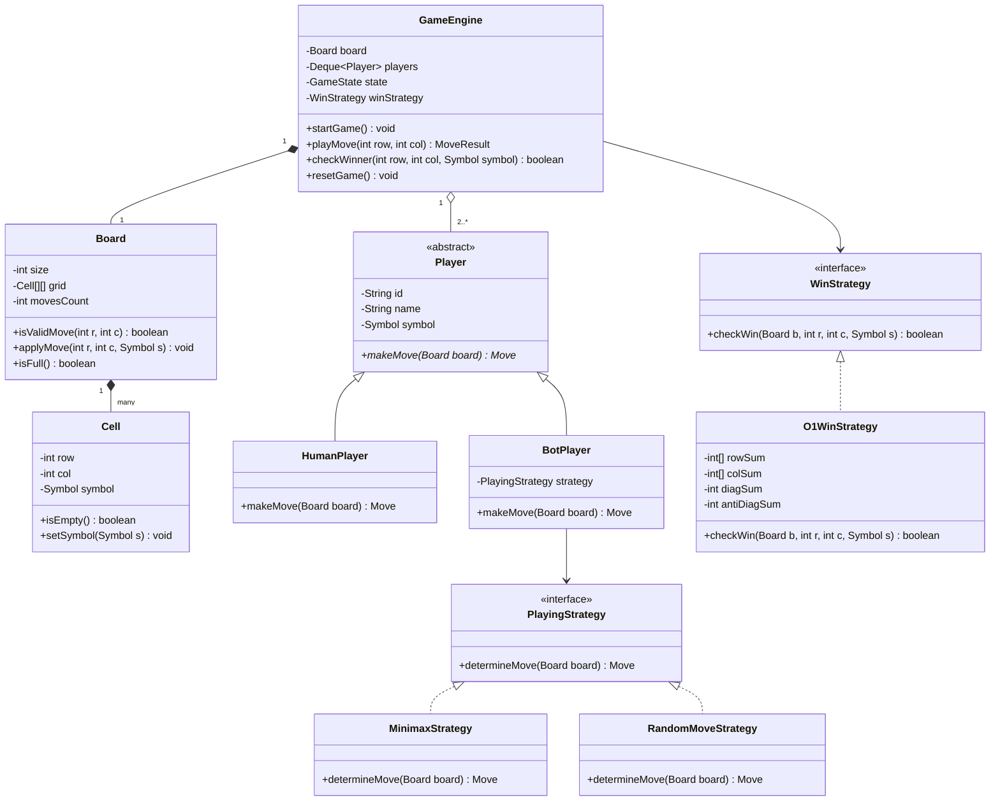
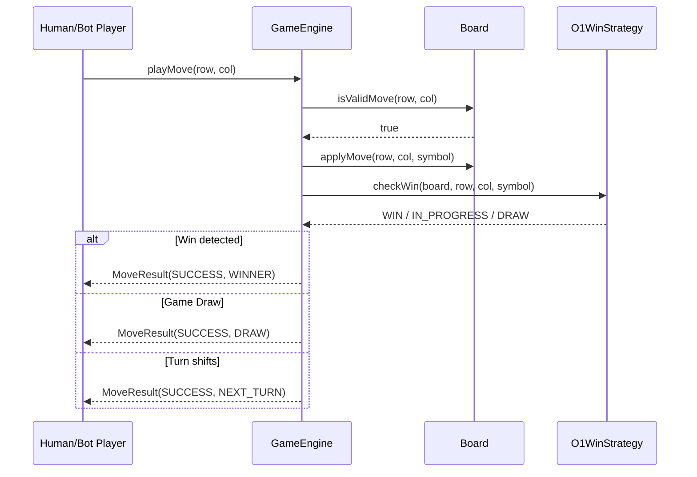

# Low Level Design (LLD): Tic Tac Toe

> **Category**: Game Design  
> **Difficulty**: Easy  
> **Primary Design Patterns**: Strategy (Move validation / Bot AI), Singleton (Game Config/Rules Engine), Observer (Turn / Game Status events)

---

## 1. Actors & Use Cases

### 1.1 Actors
- **Human Player**: joins match, selects coordinates
- **Bot Player**: computes moves via Strategy
- **Game Engine / Referee**: orchestrates turns, validates moves, checks victory in O

### 1.2 Core Use Cases
- Initialize custom N x N board (standard 3x3 or generalized N x N)
- Register 2 or more players with unique symbols (X, O, etc.)
- Player makes a move at cell (r, c)
- Evaluate win condition in O(1) time or draw condition when board is full
- Undo/redo move or broadcast board state updates

---

## 2. Class Diagram



---

## 3. Key Interfaces & Abstractions

- `PlayingStrategy`: `determineMove(Board board) -> Move` allows dynamic swapping of bot intelligence (Random, Heuristic, Minimax).
- `WinStrategy`: `checkWin(Board b, int r, int c, Symbol s) -> boolean` isolates win calculation (O(1) frequency array vs line scan).

---

## 4. Design Patterns Applied

- **Strategy Pattern**: Applied to `PlayingStrategy` (Bot AI moves) and `WinStrategy` (scoring / rule evaluation).
- **Singleton Pattern**: Global game configurations (Board dimensions, rules presets) managed via thread-safe config.
- **Observer Pattern**: Board state change listeners (UI update, sound effects, analytics logger).

---

## 5. Sequence Diagram (Key Execution Flow)



---

## 6. Data Model & Storage Strategy

```sql
-- For persistent tournament/match storage
CREATE TABLE games (
    game_id VARCHAR(64) PRIMARY KEY,
    board_size INT NOT NULL DEFAULT 3,
    status VARCHAR(32) NOT NULL, -- IN_PROGRESS, COMPLETED, DRAW
    winner_id VARCHAR(64),
    created_at TIMESTAMP DEFAULT CURRENT_TIMESTAMP
);

CREATE TABLE game_moves (
    move_id BIGSERIAL PRIMARY KEY,
    game_id VARCHAR(64) REFERENCES games(game_id),
    player_id VARCHAR(64) NOT NULL,
    row_idx INT NOT NULL,
    col_idx INT NOT NULL,
    move_number INT NOT NULL,
    played_at TIMESTAMP DEFAULT CURRENT_TIMESTAMP,
    CONSTRAINT uq_game_cell UNIQUE (game_id, row_idx, col_idx)
);
CREATE INDEX idx_game_moves ON game_moves(game_id, move_number);
```

---

## 7. Concurrency & Thread Safety Plan

In multiplayer network settings, `playMove` on `GameEngine` is guarded with a mutex or synchronized lock per `game_id`. Database writes use unique constraint `(game_id, row_idx, col_idx)` preventing simultaneous cell appropriation.

---

## 8. Failure Modes & Edge Cases

- **Concurrent double-move attempt**: Rejection via atomicity lock with `IllegalMoveException`.
- **Out of bounds or occupied cell**: Validation fails fast before state mutation.
- **Player disconnection / timeout**: A turn timer thread triggers automatic forfeit.

---

## 9. Extensibility Points

- **N-player extension**: Queue data structure naturally rotates among K players.
- **3D Tic-Tac-Toe**: Implement a 3D board class and 3D vector win evaluation strategy.
