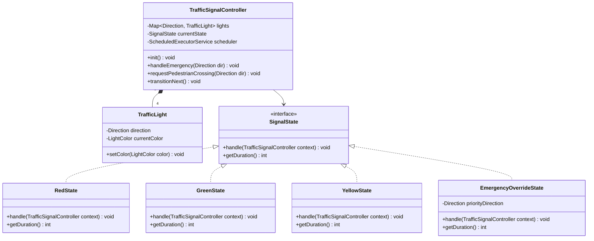
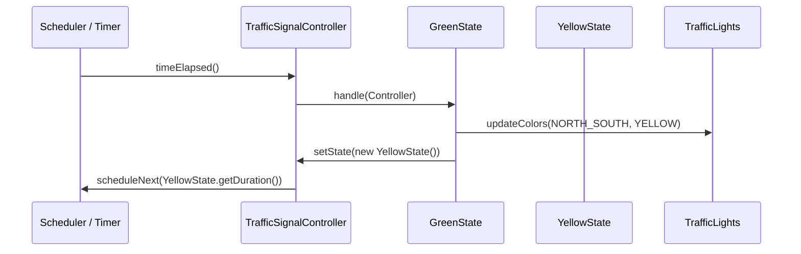

# Low Level Design (LLD): Traffic Signal

> **Category**: State / Control  
> **Difficulty**: Easy  
> **Primary Design Patterns**: State Pattern (Signal transitions), Observer (Intersection sensors), Singleton (Intersection Manager)

---

## 1. Actors & Use Cases

### 1.1 Actors
- **Intersection Controller**: orchestrator
- **Pedestrian Sensor / Button**: event trigger
- **Emergency Vehicle Detector**: override trigger

### 1.2 Core Use Cases
- Cycle lights: Red -> Green -> Yellow -> Red smoothly
- Dynamic duration adjustment based on peak hours or camera queue length
- Emergency vehicle override (force preemption to Green on active corridor)
- Pedestrian crossing request cycle insertion

---

## 2. Class Diagram



---

## 3. Key Interfaces & Abstractions

- `SignalState`: `handle(TrafficSignalController ctx)` and `getDuration() -> int` encapsulating timed state logic.
- `SensorEventListener`: `onVehicleDetected(Direction dir, int count)` reacting to traffic density.

---

## 4. Design Patterns Applied

- **State Pattern**: Replaces unwieldy switch-case loops with polymorphic state classes representing light phases.
- **Observer Pattern**: Sensor nodes publish queue length metrics to the controller.
- **Command Pattern**: Emergency preemption requests encapsulated as executable override commands.

---

## 5. Sequence Diagram (Key Execution Flow)



---

## 6. Data Model & Storage Strategy

```sql
CREATE TABLE intersection_configs (
    intersection_id VARCHAR(64) PRIMARY KEY,
    name VARCHAR(128) NOT NULL,
    default_green_sec INT DEFAULT 45,
    default_yellow_sec INT DEFAULT 5,
    default_red_sec INT DEFAULT 50,
    is_operational BOOLEAN DEFAULT TRUE
);

CREATE TABLE signal_logs (
    log_id BIGSERIAL PRIMARY KEY,
    intersection_id VARCHAR(64) REFERENCES intersection_configs(intersection_id),
    direction VARCHAR(16) NOT NULL,
    state VARCHAR(16) NOT NULL,
    duration_sec INT NOT NULL,
    triggered_by VARCHAR(32) DEFAULT 'TIMER', -- TIMER, EMERGENCY, SENSOR
    recorded_at TIMESTAMP DEFAULT CURRENT_TIMESTAMP
);
CREATE INDEX idx_signal_logs ON signal_logs(intersection_id, recorded_at DESC);
```

---

## 7. Concurrency & Thread Safety Plan

State transitions are managed by a single-threaded scheduled executor per intersection. Emergency interruptions execute via atomic compare-and-set on the active state reference with lock safety.

---

## 8. Failure Modes & Edge Cases

- **Hardware light malfunction**: Controller falls back to blinking amber/yellow failsafe mode (`FailsafeBlinkingState`).
- **Simultaneous emergency triggers on intersecting directions**: Deterministic priority queue evaluates higher authority vehicle (Ambulance > Fire Truck > Police).

---

## 9. Extensibility Points

- **Smart City Mesh**: Inter-intersection synchronization via green-wave coordination algorithms.
- **Computer vision integration**: Ingest live object-detection feeds to compute dynamic green durations.
