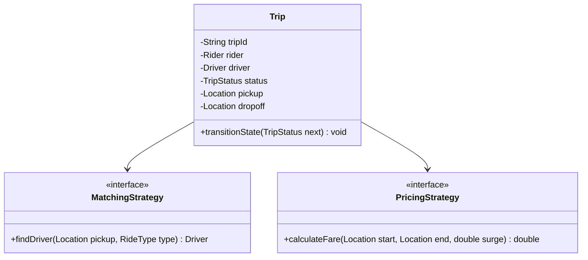
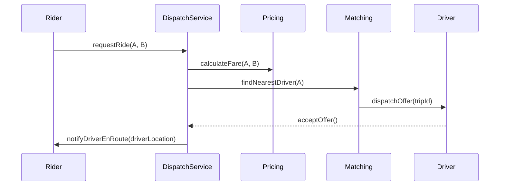

# Low Level Design (LLD): Uber / Ride-Hailing

> **Category**: Proximity / Dispatch  
> **Difficulty**: Hard  
> **Primary Design Patterns**: Observer (Live GPS location and trip status events), Strategy (Surge pricing & driver matching), State Pattern (Trip: Requested, Accepted, Arrived, InTrip, Completed)

---

## 1. Actors & Use Cases

### 1.1 Actors
- **Rider**: Rider
- **Driver**: Driver
- **Dispatch Matching Engine**: Dispatch Matching Engine
- **Pricing Engine**: Pricing Engine

### 1.2 Core Use Cases
- Request ride with pickup & drop-off coordinates
- Find nearest available drivers via Geospatial indexing (H3/Quadtree)
- Surge pricing multiplier calculation
- Trip lifecycle tracking with real-time ETA updates
- Fare split and payment settlement

---

## 2. Class Diagram

---

## 3. Key Interfaces & Abstractions

- `MatchingStrategy`: Proximity vs batch dispatch algorithm.

---

## 4. Design Patterns Applied

- State pattern guarantees trip status safety.
- Strategy pattern handles surge multiplier and routing engines.

---

## 5. Sequence Diagram (Key Execution Flow)

---

## 6. Data Model & Storage Strategy

Tables `riders`, `drivers`, `trips`, `driver_locations` (geospatial index).

---

## 7. Concurrency & Thread Safety Plan

Driver assignment via Redis conditional lock (`SET driver_lock NX PX 10000`) so an offer cannot be grabbed by multiple drivers simultaneously.

---

## 8. Failure Modes & Edge Cases

- **Driver rejects/ignores ride offer**: Cascade to next nearest candidate in priority queue.

---

## 9. Extensibility Points

- **Multi-destination stops and scheduled advance rides.**: Multi-destination stops and scheduled advance rides.
