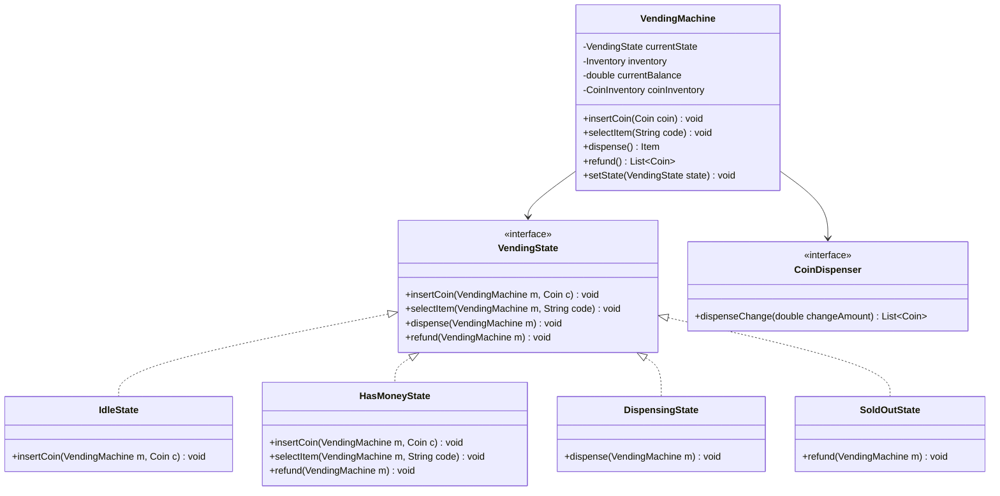
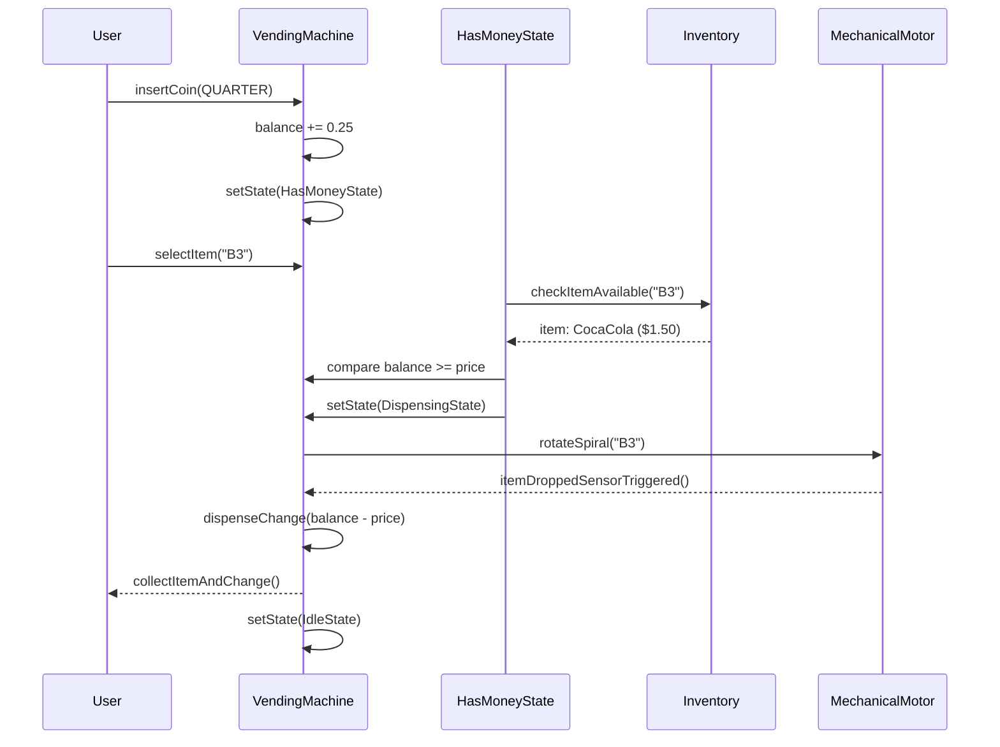

# Low Level Design (LLD): Vending Machine

> **Category**: State Pattern / Behavioral  
> **Difficulty**: Easy  
> **Primary Design Patterns**: State Pattern (Lifecycle: Idle, HasCoin, Dispense, SoldOut), Chain of Responsibility (Cash change dispensation)

---

## 1. Actors & Use Cases

### 1.1 Actors
- **Customer**: inserts money, inputs code, retrieves item & change
- **Vendor / Supplier**: restocks snacks/drinks, collects cash drawer

### 1.2 Core Use Cases
- Display item catalog, slot numbers, and prices
- Accept coin/banknote denominations ($0.25, $1.00, $5.00)
- Validate product selection against inserted balance and stock availability
- Dispense item and calculate optimal change with lowest coin count
- Cancel transaction and refund unspent amount

---

## 2. Class Diagram



---

## 3. Key Interfaces & Abstractions

- `VendingState`: Encapsulates valid actions permitted per state.
- `CoinDispenser`: Algorithm for computing change (Greedy vs Dynamic Programming change-maker).

---

## 4. Design Patterns Applied

- **State Pattern**: Ensures invalid sequences (e.g. dispensing with zero balance) are cleanly rejected at the type/object level.
- **Chain of Responsibility**: Coin verification mechanism sequentially validates weight and diameter sensors.
- **Strategy Pattern**: Optimal change calculation strategy.

---

## 5. Sequence Diagram (Key Execution Flow)



---

## 6. Data Model & Storage Strategy

```sql
CREATE TABLE vending_slots (
    slot_code VARCHAR(8) PRIMARY KEY, -- e.g. A1, B3
    item_name VARCHAR(64) NOT NULL,
    price DECIMAL(5,2) NOT NULL,
    current_quantity INT NOT NULL,
    max_capacity INT NOT NULL
);

CREATE TABLE vending_transactions (
    txn_id UUID PRIMARY KEY,
    slot_code VARCHAR(8) REFERENCES vending_slots(slot_code),
    amount_paid DECIMAL(5,2) NOT NULL,
    change_given DECIMAL(5,2) NOT NULL,
    status VARCHAR(32) NOT NULL, -- SUCCESS, CANCELLED, MOTOR_JAM
    created_at TIMESTAMP DEFAULT CURRENT_TIMESTAMP
);
```

---

## 7. Concurrency & Thread Safety Plan

State modifications synchronized on the machine instance. Multi-threaded hardware polling (infrared drop-sensor and coin validator) communicate via synchronized thread-safe event queue.

---

## 8. Failure Modes & Edge Cases

- **Item stuck in spiral**: Optical drop sensor fails to detect drop; mechanical motor attempts reverse-wiggle. If unresolved, refund issued and slot marked `JAMMED`.
- **Insufficient change in coin hopper**: Alert displayed, transaction rejected before dispensing.

---

## 9. Extensibility Points

- **Digital Wallet integration**: UPI/NFC tap-to-pay via external payment gateway adapter.
- **Dynamic pricing**: Surge pricing for cold beverages during high ambient temperatures.
