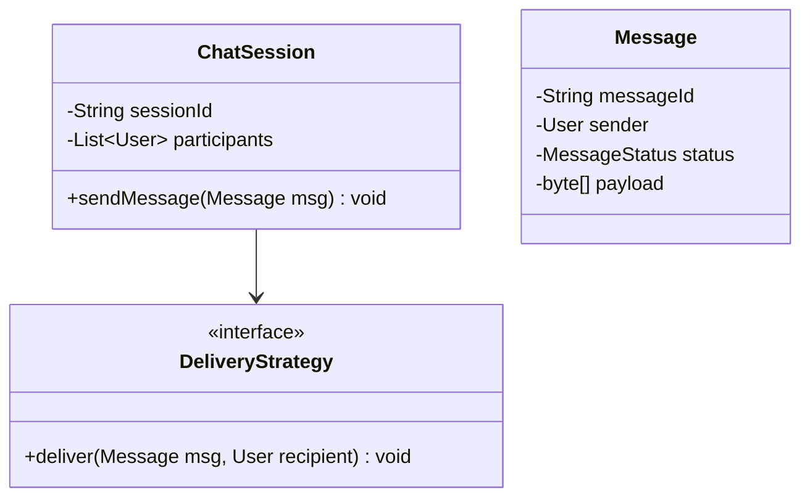
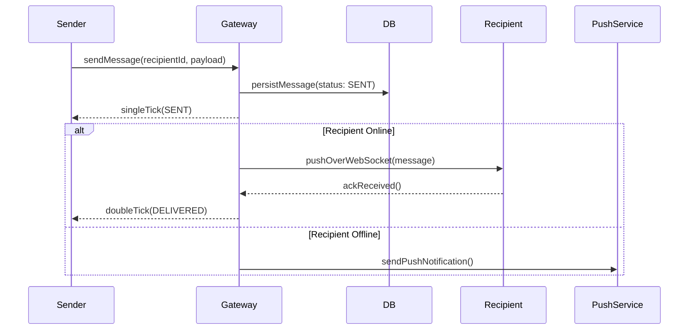

# Low Level Design (LLD): WhatsApp / Chat System

> **Category**: Distributed OOD  
> **Difficulty**: Hard  
> **Primary Design Patterns**: Observer (Push notifications and live presence), Strategy (Message encryption & media compression), Singleton (Connection Manager)

---

## 1. Actors & Use Cases

### 1.1 Actors
- **User / Sender**: User / Sender
- **Recipient**: Recipient
- **Chat Gateway Server**: Chat Gateway Server
- **Media CDN**: Media CDN

### 1.2 Core Use Cases
- One-on-one and Group messaging
- Message delivery status (Sent, Delivered, Read ticks)
- Last seen and online presence tracking
- End-to-End Encryption (E2EE) key exchange
- Media sharing (images, voice notes)

---

## 2. Class Diagram

---

## 3. Key Interfaces & Abstractions

- `DeliveryStrategy`: Direct WebSocket connection vs Offline Push Notification (APNS/FCM).

---

## 4. Design Patterns Applied

- Observer pattern updates online presence and typing indicators.
- Strategy pattern handles media compression algorithms.

---

## 5. Sequence Diagram (Key Execution Flow)

---

## 6. Data Model & Storage Strategy

Tables `users`, `conversations`, `conversation_members`, `messages`.

---

## 7. Concurrency & Thread Safety Plan

Per-user sequence numbering for strict message order without cross-thread interleaving.

---

## 8. Failure Modes & Edge Cases

- **Recipient offline**: Messages stored in offline mailbox queue (Cassandra/ScyllaDB) until device reconnects.

---

## 9. Extensibility Points

- **Disappearing messages and multi-device cryptographic synchronization.**: Disappearing messages and multi-device cryptographic synchronization.
